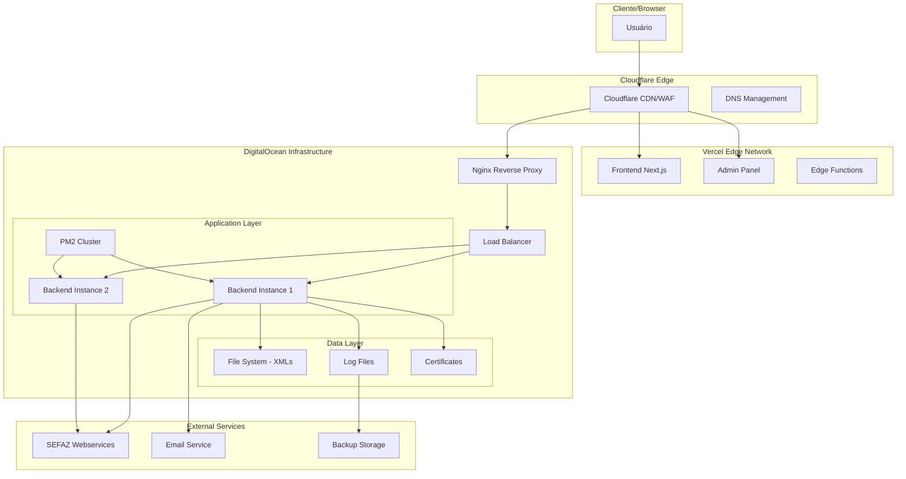

# ARQUITETURA E DEPLOY DETALHADO
## Sistema NFe Brandão Contador

---

## 🏗️ ARQUITETURA TÉCNICA COMPLETA

### 1. Visão Geral da Arquitetura



### 2. Especificações Técnicas

#### 2.1 Frontend (Vercel)
```typescript
// Tecnologias
Next.js 15.5.4
React 19.1.0
Tailwind CSS 4
TypeScript 5
NextAuth.js 4.24.11

// Configurações de Build
{
  "framework": "nextjs",
  "buildCommand": "npm run build",
  "outputDirectory": ".next",
  "installCommand": "npm install",
  "devCommand": "npm run dev"
}
```

#### 2.2 Backend (DigitalOcean)
```javascript
// Stack Tecnológico
Node.js 18.x LTS
Express.js 4.x
PM2 5.x (Process Manager)
Nginx 1.22.x (Reverse Proxy)
Ubuntu 22.04 LTS

// Configurações de Performance
{
  "instances": 2,
  "exec_mode": "cluster",
  "max_memory_restart": "1G",
  "node_args": "--max-old-space-size=1024"
}
```

---

## 🚀 CONFIGURAÇÕES DE DEPLOY DETALHADAS

### 1. GitHub Actions - CI/CD Pipeline

#### 1.1 Workflow Principal
```yaml
# .github/workflows/main.yml
name: Deploy NFe System

on:
  push:
    branches: [main, develop]
  pull_request:
    branches: [main]

env:
  NODE_VERSION: '18'
  VERCEL_ORG_ID: ${{ secrets.VERCEL_ORG_ID }}
  VERCEL_PROJECT_ID: ${{ secrets.VERCEL_PROJECT_ID }}

jobs:
  test:
    runs-on: ubuntu-latest
    steps:
      - name: Checkout code
        uses: actions/checkout@v4
        
      - name: Setup Node.js
        uses: actions/setup-node@v4
        with:
          node-version: ${{ env.NODE_VERSION }}
          cache: 'npm'
          
      - name: Install dependencies
        run: |
          cd frontend && npm ci
          cd ../backend && npm ci
          
      - name: Run tests
        run: |
          cd frontend && npm run test
          cd ../backend && npm run test
          
      - name: Run linting
        run: |
          cd frontend && npm run lint
          cd ../backend && npm run lint

  deploy-frontend:
    needs: test
    runs-on: ubuntu-latest
    if: github.ref == 'refs/heads/main'
    steps:
      - name: Checkout code
        uses: actions/checkout@v4
        
      - name: Deploy to Vercel
        uses: amondnet/vercel-action@v25
        with:
          vercel-token: ${{ secrets.VERCEL_TOKEN }}
          vercel-org-id: ${{ secrets.VERCEL_ORG_ID }}
          vercel-project-id: ${{ secrets.VERCEL_PROJECT_ID }}
          working-directory: ./frontend
          vercel-args: '--prod'

  deploy-admin:
    needs: test
    runs-on: ubuntu-latest
    if: github.ref == 'refs/heads/main'
    steps:
      - name: Checkout code
        uses: actions/checkout@v4
        
      - name: Deploy Admin to Vercel
        uses: amondnet/vercel-action@v25
        with:
          vercel-token: ${{ secrets.VERCEL_TOKEN }}
          vercel-org-id: ${{ secrets.VERCEL_ADMIN_ORG_ID }}
          vercel-project-id: ${{ secrets.VERCEL_ADMIN_PROJECT_ID }}
          working-directory: ./admin
          vercel-args: '--prod'

  deploy-backend:
    needs: test
    runs-on: ubuntu-latest
    if: github.ref == 'refs/heads/main'
    steps:
      - name: Deploy to DigitalOcean
        uses: appleboy/ssh-action@v1.0.0
        with:
          host: ${{ secrets.DO_HOST }}
          username: ${{ secrets.DO_USERNAME }}
          key: ${{ secrets.DO_SSH_KEY }}
          port: ${{ secrets.DO_PORT }}
          script: |
            cd /var/www/nfe-backend
            git pull origin main
            npm install --production
            npm run build
            pm2 reload ecosystem.production.js
            pm2 save
            
      - name: Health Check
        run: |
          sleep 30
          curl -f https://api.brandaocontador.com.br/health || exit 1
```

#### 1.2 Secrets Necessários
```bash
# GitHub Secrets
VERCEL_TOKEN=your_vercel_token
VERCEL_ORG_ID=your_org_id
VERCEL_PROJECT_ID=your_project_id
VERCEL_ADMIN_ORG_ID=your_admin_org_id
VERCEL_ADMIN_PROJECT_ID=your_admin_project_id
DO_HOST=your_digitalocean_ip
DO_USERNAME=deploy
DO_SSH_KEY=your_private_key
DO_PORT=22
```

### 2. Vercel - Configuração Frontend

#### 2.1 Configuração do Projeto Principal
```json
// frontend/vercel.json
{
  "version": 2,
  "framework": "nextjs",
  "buildCommand": "npm run build",
  "outputDirectory": ".next",
  "installCommand": "npm install",
  "functions": {
    "app/api/**/*.ts": {
      "maxDuration": 30
    }
  },
  "headers": [
    {
      "source": "/api/(.*)",
      "headers": [
        {
          "key": "Access-Control-Allow-Origin",
          "value": "https://nfe.brandaocontador.com.br"
        },
        {
          "key": "Access-Control-Allow-Methods",
          "value": "GET, POST, PUT, DELETE, OPTIONS"
        },
        {
          "key": "Access-Control-Allow-Headers",
          "value": "Content-Type, Authorization"
        }
      ]
    }
  ],
  "redirects": [
    {
      "source": "/admin",
      "destination": "https://admin.brandaocontador.com.br",
      "permanent": true
    }
  ],
  "rewrites": [
    {
      "source": "/api/backend/(.*)",
      "destination": "https://api.brandaocontador.com.br/$1"
    }
  ]
}
```

#### 2.2 Variáveis de Ambiente - Frontend
```bash
# Production Environment Variables
NEXT_PUBLIC_API_URL=https://api.brandaocontador.com.br
NEXT_PUBLIC_ADMIN_URL=https://admin.brandaocontador.com.br
NEXT_PUBLIC_ENVIRONMENT=production
NEXT_PUBLIC_SENTRY_DSN=your_sentry_dsn

# Authentication
NEXTAUTH_URL=https://nfe.brandaocontador.com.br
NEXTAUTH_SECRET=your_nextauth_secret_key

# OAuth Providers
GOOGLE_CLIENT_ID=your_google_client_id
GOOGLE_CLIENT_SECRET=your_google_client_secret

# Analytics
GOOGLE_ANALYTICS_ID=your_ga_id
```

#### 2.3 Configuração do Painel Admin
```json
// admin/vercel.json
{
  "version": 2,
  "framework": "nextjs",
  "buildCommand": "npm run build",
  "outputDirectory": ".next",
  "functions": {
    "app/api/**/*.ts": {
      "maxDuration": 60
    }
  },
  "headers": [
    {
      "source": "/(.*)",
      "headers": [
        {
          "key": "X-Frame-Options",
          "value": "DENY"
        },
        {
          "key": "X-Content-Type-Options",
          "value": "nosniff"
        },
        {
          "key": "Referrer-Policy",
          "value": "strict-origin-when-cross-origin"
        }
      ]
    }
  ]
}
```

### 3. DigitalOcean - Configuração Backend

#### 3.1 Especificações do Droplet
```yaml
# Droplet Configuration
Name: nfe-backend-prod
Image: Ubuntu 22.04 LTS
Size: s-2vcpu-4gb (2 vCPUs, 4GB RAM, 80GB SSD)
Region: sfo3 (São Paulo)
VPC: default
Backups: enabled
Monitoring: enabled
Firewall: nfe-backend-fw
```

#### 3.2 Script de Setup Inicial
```bash
#!/bin/bash
# scripts/setup-production-server.sh

set -e

echo "🚀 Configurando servidor de produção NFe..."

# Atualizar sistema
sudo apt update && sudo apt upgrade -y

# Instalar dependências básicas
sudo apt install -y curl wget git unzip software-properties-common

# Instalar Node.js 18
curl -fsSL https://deb.nodesource.com/setup_18.x | sudo -E bash -
sudo apt-get install -y nodejs

# Verificar versões
node --version
npm --version

# Instalar PM2 globalmente
sudo npm install -g pm2

# Instalar Nginx
sudo apt install nginx -y
sudo systemctl start nginx
sudo systemctl enable nginx

# Configurar firewall
sudo ufw allow OpenSSH
sudo ufw allow 'Nginx Full'
sudo ufw --force enable

# Criar usuário deploy
sudo adduser --disabled-password --gecos "" deploy
sudo usermod -aG sudo deploy

# Configurar diretórios
sudo mkdir -p /var/www/nfe-backend
sudo mkdir -p /var/log/nfe
sudo mkdir -p /var/backups/nfe
sudo chown -R deploy:deploy /var/www/nfe-backend
sudo chown -R deploy:deploy /var/log/nfe

# Instalar Certbot
sudo apt install certbot python3-certbot-nginx -y

# Configurar logrotate
sudo tee /etc/logrotate.d/nfe-backend > /dev/null <<EOF
/var/log/nfe/*.log {
    daily
    missingok
    rotate 30
    compress
    delaycompress
    notifempty
    create 0644 deploy deploy
    postrotate
        pm2 reloadLogs
    endscript
}
EOF

echo "✅ Servidor configurado com sucesso!"
echo "📝 Próximos passos:"
echo "   1. Configurar chaves SSH para usuário deploy"
echo "   2. Clonar repositório em /var/www/nfe-backend"
echo "   3. Configurar variáveis de ambiente"
echo "   4. Configurar Nginx"
echo "   5. Configurar SSL com Certbot"
```

#### 3.3 Configuração Nginx Completa
```nginx
# /etc/nginx/sites-available/nfe-api
server {
    listen 80;
    server_name api.brandaocontador.com.br;
    
    # Redirect HTTP to HTTPS
    return 301 https://$server_name$request_uri;
}

server {
    listen 443 ssl http2;
    server_name api.brandaocontador.com.br;
    
    # SSL Configuration
    ssl_certificate /etc/letsencrypt/live/api.brandaocontador.com.br/fullchain.pem;
    ssl_certificate_key /etc/letsencrypt/live/api.brandaocontador.com.br/privkey.pem;
    ssl_protocols TLSv1.2 TLSv1.3;
    ssl_ciphers ECDHE-RSA-AES256-GCM-SHA512:DHE-RSA-AES256-GCM-SHA512:ECDHE-RSA-AES256-GCM-SHA384:DHE-RSA-AES256-GCM-SHA384;
    ssl_prefer_server_ciphers off;
    ssl_session_cache shared:SSL:10m;
    ssl_session_timeout 10m;
    
    # Security Headers
    add_header X-Frame-Options "SAMEORIGIN" always;
    add_header X-Content-Type-Options "nosniff" always;
    add_header X-XSS-Protection "1; mode=block" always;
    add_header Referrer-Policy "strict-origin-when-cross-origin" always;
    add_header Content-Security-Policy "default-src 'self'; script-src 'self'; style-src 'self' 'unsafe-inline'; img-src 'self' data: https:; font-src 'self'; connect-src 'self' https://api.brandaocontador.com.br; frame-ancestors 'none';" always;
    
    # CORS Headers
    add_header Access-Control-Allow-Origin "https://nfe.brandaocontador.com.br, https://admin.brandaocontador.com.br" always;
    add_header Access-Control-Allow-Methods "GET, POST, PUT, DELETE, OPTIONS" always;
    add_header Access-Control-Allow-Headers "Content-Type, Authorization, X-Requested-With" always;
    add_header Access-Control-Allow-Credentials "true" always;
    
    # Handle preflight requests
    if ($request_method = 'OPTIONS') {
        add_header Access-Control-Allow-Origin "https://nfe.brandaocontador.com.br, https://admin.brandaocontador.com.br";
        add_header Access-Control-Allow-Methods "GET, POST, PUT, DELETE, OPTIONS";
        add_header Access-Control-Allow-Headers "Content-Type, Authorization, X-Requested-With";
        add_header Access-Control-Allow-Credentials "true";
        add_header Content-Length 0;
        add_header Content-Type text/plain;
        return 204;
    }
    
    # Rate Limiting
    limit_req_zone $binary_remote_addr zone=api:10m rate=10r/s;
    limit_req zone=api burst=20 nodelay;
    
    # Logging
    access_log /var/log/nginx/nfe-api.access.log;
    error_log /var/log/nginx/nfe-api.error.log;
    
    # Gzip Compression
    gzip on;
    gzip_vary on;
    gzip_min_length 1024;
    gzip_types text/plain text/css text/xml text/javascript application/javascript application/xml+rss application/json;
    
    # Main proxy configuration
    location / {
        proxy_pass http://127.0.0.1:3001;
        proxy_http_version 1.1;
        proxy_set_header Upgrade $http_upgrade;
        proxy_set_header Connection 'upgrade';
        proxy_set_header Host $host;
        proxy_set_header X-Real-IP $remote_addr;
        proxy_set_header X-Forwarded-For $proxy_add_x_forwarded_for;
        proxy_set_header X-Forwarded-Proto $scheme;
        proxy_cache_bypass $http_upgrade;
        
        # Timeouts
        proxy_connect_timeout 60s;
        proxy_send_timeout 60s;
        proxy_read_timeout 60s;
        
        # Buffer settings
        proxy_buffering on;
        proxy_buffer_size 128k;
        proxy_buffers 4 256k;
        proxy_busy_buffers_size 256k;
    }
    
    # Health check endpoint
    location /health {
        proxy_pass http://127.0.0.1:3001/health;
        access_log off;
    }
    
    # Static files (if any)
    location /static/ {
        alias /var/www/nfe-backend/public/;
        expires 1y;
        add_header Cache-Control "public, immutable";
    }
}
```

#### 3.4 Configuração PM2 Avançada
```javascript
// ecosystem.production.js
module.exports = {
  apps: [{
    name: 'nfe-backend',
    script: 'app.js',
    cwd: '/var/www/nfe-backend',
    instances: 2,
    exec_mode: 'cluster',
    
    // Environment
    env: {
      NODE_ENV: 'production',
      PORT: 3001
    },
    
    // Logging
    error_file: '/var/log/nfe/nfe-backend-error.log',
    out_file: '/var/log/nfe/nfe-backend-out.log',
    log_file: '/var/log/nfe/nfe-backend.log',
    time: true,
    log_date_format: 'YYYY-MM-DD HH:mm:ss Z',
    
    // Performance
    max_memory_restart: '1G',
    node_args: '--max-old-space-size=1024',
    
    // Restart policies
    autorestart: true,
    max_restarts: 10,
    min_uptime: '10s',
    
    // Monitoring
    watch: false,
    ignore_watch: ['node_modules', 'logs', 'xmls'],
    
    // Advanced options
    kill_timeout: 5000,
    listen_timeout: 3000,
    
    // Health check
    health_check_grace_period: 3000
  }],
  
  deploy: {
    production: {
      user: 'deploy',
      host: 'api.brandaocontador.com.br',
      ref: 'origin/main',
      repo: 'git@github.com:brandaocontador/nfe-system.git',
      path: '/var/www/nfe-backend',
      'pre-deploy-local': '',
      'post-deploy': 'npm install --production && pm2 reload ecosystem.production.js --env production && pm2 save',
      'pre-setup': ''
    }
  }
};
```

### 4. Configuração de Domínios e DNS

#### 4.1 Cloudflare DNS Records
```bash
# DNS Configuration
Type    Name                            Content                     TTL     Proxy
A       api.brandaocontador.com.br      YOUR_DIGITALOCEAN_IP       Auto    ✅
CNAME   nfe.brandaocontador.com.br      cname.vercel-dns.com       Auto    ✅
CNAME   admin.brandaocontador.com.br    cname.vercel-dns.com       Auto    ✅
CNAME   www.brandaocontador.com.br      brandaocontador.com.br     Auto    ✅
```

#### 4.2 Cloudflare Page Rules
```bash
# Page Rules Configuration
1. https://api.brandaocontador.com.br/*
   - SSL: Full (strict)
   - Security Level: Medium
   - Cache Level: Bypass
   
2. https://nfe.brandaocontador.com.br/*
   - SSL: Full (strict)
   - Security Level: Medium
   - Browser Cache TTL: 4 hours
   
3. https://admin.brandaocontador.com.br/*
   - SSL: Full (strict)
   - Security Level: High
   - Browser Cache TTL: 1 hour
```

### 5. Monitoramento e Logs

#### 5.1 Configuração de Monitoramento
```javascript
// monitoring/health-check.js
const express = require('express');
const app = express();

app.get('/health', async (req, res) => {
  const health = {
    status: 'ok',
    timestamp: new Date().toISOString(),
    uptime: process.uptime(),
    memory: process.memoryUsage(),
    
    services: {
      database: await checkDatabase(),
      sefaz: await checkSefaz(),
      filesystem: await checkFilesystem(),
      certificates: await checkCertificates()
    }
  };
  
  const isHealthy = Object.values(health.services).every(service => service.status === 'ok');
  
  res.status(isHealthy ? 200 : 503).json(health);
});

app.get('/metrics', (req, res) => {
  // Prometheus metrics
  res.set('Content-Type', 'text/plain');
  res.send(generateMetrics());
});
```

#### 5.2 Configuração de Logs
```javascript
// config/logger.js
const winston = require('winston');
const path = require('path');

const logger = winston.createLogger({
  level: process.env.LOG_LEVEL || 'info',
  format: winston.format.combine(
    winston.format.timestamp(),
    winston.format.errors({ stack: true }),
    winston.format.json()
  ),
  defaultMeta: { service: 'nfe-backend' },
  transports: [
    new winston.transports.File({
      filename: '/var/log/nfe/error.log',
      level: 'error',
      maxsize: 5242880, // 5MB
      maxFiles: 10
    }),
    new winston.transports.File({
      filename: '/var/log/nfe/combined.log',
      maxsize: 5242880, // 5MB
      maxFiles: 10
    })
  ]
});

if (process.env.NODE_ENV !== 'production') {
  logger.add(new winston.transports.Console({
    format: winston.format.simple()
  }));
}

module.exports = logger;
```

### 6. Backup e Recuperação

#### 6.1 Script de Backup
```bash
#!/bin/bash
# scripts/backup.sh

set -e

BACKUP_DIR="/var/backups/nfe"
DATE=$(date +"%Y%m%d_%H%M%S")
BACKUP_NAME="nfe_backup_${DATE}"

echo "🔄 Iniciando backup do sistema NFe..."

# Criar diretório de backup
mkdir -p "${BACKUP_DIR}/${BACKUP_NAME}"

# Backup dos XMLs
echo "📄 Fazendo backup dos XMLs..."
tar -czf "${BACKUP_DIR}/${BACKUP_NAME}/xmls.tar.gz" -C /var/www/nfe-backend xmls/

# Backup dos logs
echo "📋 Fazendo backup dos logs..."
tar -czf "${BACKUP_DIR}/${BACKUP_NAME}/logs.tar.gz" -C /var/log nfe/

# Backup dos certificados
echo "🔐 Fazendo backup dos certificados..."
tar -czf "${BACKUP_DIR}/${BACKUP_NAME}/certs.tar.gz" -C /var/www/nfe-backend certs/

# Backup das configurações
echo "⚙️ Fazendo backup das configurações..."
cp /var/www/nfe-backend/.env "${BACKUP_DIR}/${BACKUP_NAME}/"
cp /etc/nginx/sites-available/nfe-api "${BACKUP_DIR}/${BACKUP_NAME}/"
cp /var/www/nfe-backend/ecosystem.production.js "${BACKUP_DIR}/${BACKUP_NAME}/"

# Compactar backup final
echo "🗜️ Compactando backup..."
tar -czf "${BACKUP_DIR}/${BACKUP_NAME}.tar.gz" -C "${BACKUP_DIR}" "${BACKUP_NAME}"
rm -rf "${BACKUP_DIR}/${BACKUP_NAME}"

# Limpar backups antigos (manter últimos 30 dias)
find "${BACKUP_DIR}" -name "nfe_backup_*.tar.gz" -mtime +30 -delete

echo "✅ Backup concluído: ${BACKUP_DIR}/${BACKUP_NAME}.tar.gz"

# Enviar para storage externo (opcional)
if [ -n "$BACKUP_STORAGE_URL" ]; then
    echo "☁️ Enviando backup para storage externo..."
    # Implementar upload para S3, Google Cloud, etc.
fi
```

#### 6.2 Crontab para Backups Automáticos
```bash
# Adicionar ao crontab do usuário deploy
# crontab -e

# Backup diário às 2:00 AM
0 2 * * * /var/www/nfe-backend/scripts/backup.sh >> /var/log/nfe/backup.log 2>&1

# Limpeza de logs às 3:00 AM
0 3 * * * find /var/log/nfe -name "*.log" -mtime +7 -delete

# Verificação de saúde a cada 5 minutos
*/5 * * * * curl -f http://localhost:3001/health > /dev/null 2>&1 || echo "$(date): Health check failed" >> /var/log/nfe/health.log
```

---

## 🔒 SEGURANÇA E COMPLIANCE

### 1. Configurações de Segurança

#### 1.1 Firewall (UFW)
```bash
# Configuração do firewall
sudo ufw default deny incoming
sudo ufw default allow outgoing
sudo ufw allow ssh
sudo ufw allow 80/tcp
sudo ufw allow 443/tcp
sudo ufw enable

# Regras específicas para NFe
sudo ufw allow from 10.0.0.0/8 to any port 3001  # Apenas rede interna
sudo ufw deny 3001  # Bloquear acesso direto externo
```

#### 1.2 Fail2Ban
```bash
# Instalar e configurar Fail2Ban
sudo apt install fail2ban -y

# Configuração personalizada
sudo tee /etc/fail2ban/jail.local > /dev/null <<EOF
[DEFAULT]
bantime = 3600
findtime = 600
maxretry = 5

[sshd]
enabled = true
port = ssh
logpath = /var/log/auth.log
maxretry = 3

[nginx-http-auth]
enabled = true
filter = nginx-http-auth
logpath = /var/log/nginx/error.log
maxretry = 3

[nginx-limit-req]
enabled = true
filter = nginx-limit-req
logpath = /var/log/nginx/error.log
maxretry = 10
EOF

sudo systemctl enable fail2ban
sudo systemctl start fail2ban
```

### 2. Certificados e Criptografia

#### 2.1 Gestão de Certificados SSL
```bash
# Gerar certificados SSL
sudo certbot --nginx -d api.brandaocontador.com.br

# Auto-renovação
sudo crontab -e
# Adicionar:
0 12 * * * /usr/bin/certbot renew --quiet

# Verificar renovação
sudo certbot renew --dry-run
```

#### 2.2 Certificados Digitais NFe
```javascript
// services/certificate-manager.js
class CertificateManager {
  constructor() {
    this.certPath = process.env.CERT_PATH;
    this.certPassword = process.env.CERT_PASSWORD;
  }
  
  async validateCertificate() {
    try {
      const cert = await this.loadCertificate();
      const now = new Date();
      const expiryDate = new Date(cert.validTo);
      
      if (expiryDate <= now) {
        throw new Error('Certificado expirado');
      }
      
      if (expiryDate - now < 30 * 24 * 60 * 60 * 1000) { // 30 dias
        console.warn('Certificado expira em menos de 30 dias');
      }
      
      return { valid: true, expiresAt: expiryDate };
    } catch (error) {
      return { valid: false, error: error.message };
    }
  }
}
```

---

## 📊 MÉTRICAS E PERFORMANCE

### 1. Monitoramento de Performance

#### 1.1 Métricas de Sistema
```javascript
// monitoring/metrics.js
const promClient = require('prom-client');

// Métricas customizadas
const nfeEmissionCounter = new promClient.Counter({
  name: 'nfe_emissions_total',
  help: 'Total number of NFe emissions',
  labelNames: ['status', 'environment']
});

const nfeEmissionDuration = new promClient.Histogram({
  name: 'nfe_emission_duration_seconds',
  help: 'Duration of NFe emission process',
  buckets: [0.1, 0.5, 1, 2, 5, 10]
});

const sefazResponseTime = new promClient.Histogram({
  name: 'sefaz_response_time_seconds',
  help: 