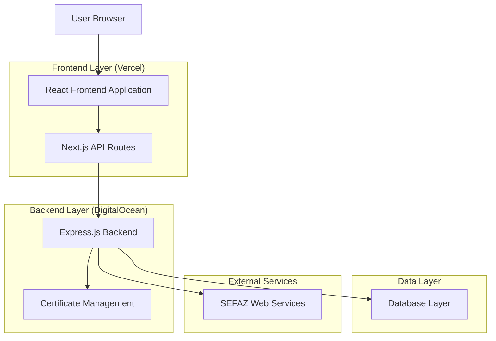
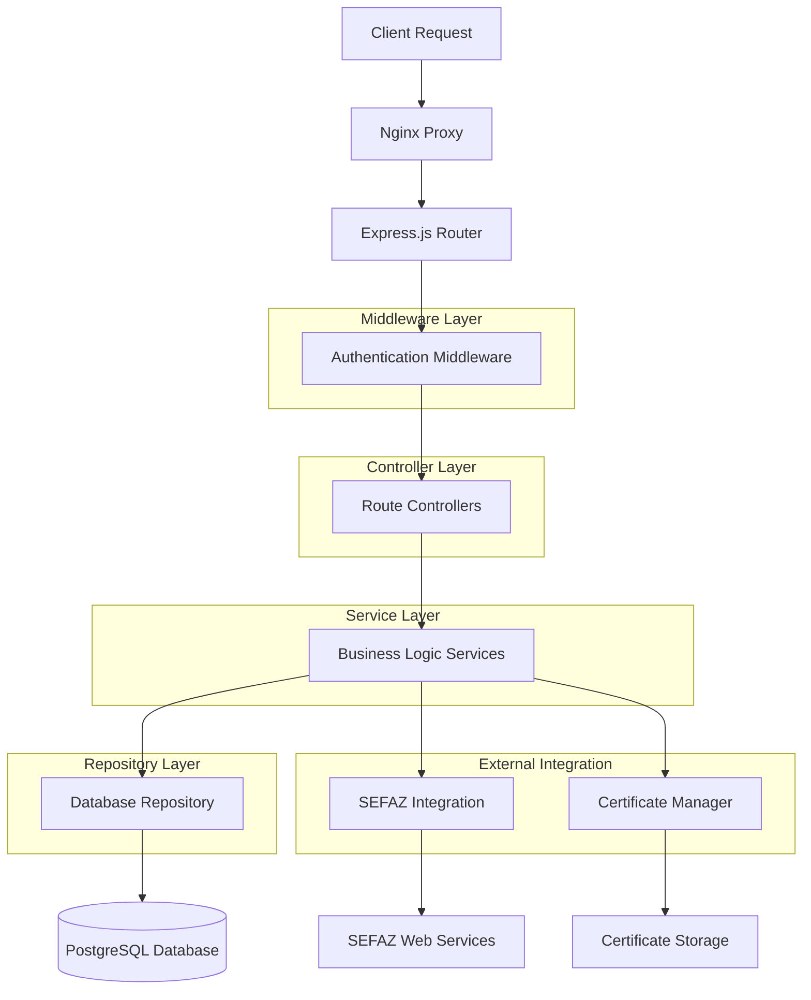
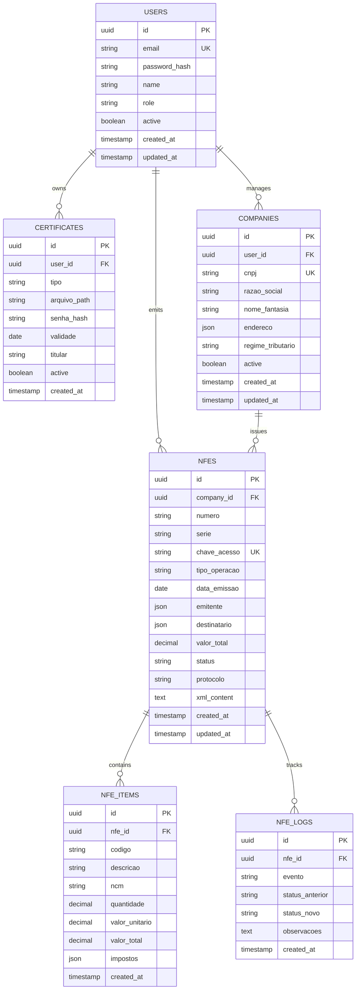

# Documento de Arquitetura Técnica - Sistema NFe

## 1. Architecture design



## 2. Technology Description

- **Frontend**: React@18 + Next.js@14 + TypeScript + Tailwind CSS@3 + NextAuth.js
- **Backend**: Node.js@18 + Express.js@4 + TypeScript + Winston (logging)
- **Database**: PostgreSQL (via Supabase)
- **Authentication**: NextAuth.js + JWT
- **File Storage**: Local filesystem + Supabase Storage
- **Process Management**: PM2
- **Proxy**: Nginx
- **SSL**: Let's Encrypt

## 3. Route definitions

| Route | Purpose |
|-------|----------|
| / | Dashboard principal, exibe estatísticas e atalhos |
| /login | Página de login, autenticação de usuários |
| /register | Página de registro, criação de novas contas |
| /nfe/emitir | Formulário de emissão de NFe |
| /nfe/validar | Página de validação de NFe por chave ou XML |
| /nfe/historico | Listagem e filtros do histórico de NFe |
| /configuracoes | Configurações da empresa e certificados |
| /admin | Painel administrativo (apenas admins) |
| /admin/usuarios | Gestão de usuários do sistema |
| /admin/monitoramento | Métricas e logs do sistema |

## 4. API definitions

### 4.1 Core API

#### Autenticação
```
POST /api/auth/login
```

Request:
| Param Name | Param Type | isRequired | Description |
|------------|------------|------------|--------------|
| email | string | true | Email do usuário |
| password | string | true | Senha do usuário |

Response:
| Param Name | Param Type | Description |
|------------|------------|-------------|
| success | boolean | Status da autenticação |
| token | string | JWT token de acesso |
| user | object | Dados do usuário |

Example:
```json
{
  "email": "usuario@exemplo.com",
  "password": "senha123"
}
```

#### Emissão de NFe
```
POST /api/nfe/emitir
```

Request:
| Param Name | Param Type | isRequired | Description |
|------------|------------|------------|--------------|
| numero | string | true | Número da NFe |
| serie | string | true | Série da NFe |
| emitente | object | true | Dados do emitente |
| destinatario | object | true | Dados do destinatário |
| itens | array | true | Lista de itens da NFe |
| tipoOperacao | string | true | Tipo de operação fiscal |

Response:
| Param Name | Param Type | Description |
|------------|------------|-------------|
| success | boolean | Status da emissão |
| chaveAcesso | string | Chave de acesso da NFe |
| protocolo | string | Protocolo de autorização |
| xml | string | XML da NFe autorizada |

#### Validação de NFe
```
GET /api/nfe/validar/:chave
```

Request:
| Param Name | Param Type | isRequired | Description |
|------------|------------|------------|--------------|
| chave | string | true | Chave de acesso da NFe |

Response:
| Param Name | Param Type | Description |
|------------|------------|-------------|
| success | boolean | Status da consulta |
| status | string | Status da NFe na SEFAZ |
| dados | object | Dados da NFe |

#### Histórico de NFe
```
GET /api/nfe/historico
```

Request:
| Param Name | Param Type | isRequired | Description |
|------------|------------|------------|--------------|
| page | number | false | Página da listagem |
| limit | number | false | Itens por página |
| dataInicio | string | false | Data inicial do filtro |
| dataFim | string | false | Data final do filtro |
| status | string | false | Filtro por status |

Response:
| Param Name | Param Type | Description |
|------------|------------|-------------|
| success | boolean | Status da consulta |
| data | array | Lista de NFe |
| total | number | Total de registros |
| page | number | Página atual |

#### Configurações da Empresa
```
PUT /api/configuracoes/empresa
```

Request:
| Param Name | Param Type | isRequired | Description |
|------------|------------|------------|--------------|
| cnpj | string | true | CNPJ da empresa |
| razaoSocial | string | true | Razão social |
| endereco | object | true | Endereço completo |
| regimeTributario | string | true | Regime tributário |

Response:
| Param Name | Param Type | Description |
|------------|------------|-------------|
| success | boolean | Status da atualização |
| message | string | Mensagem de retorno |

#### Upload de Certificado
```
POST /api/certificados/upload
```

Request:
| Param Name | Param Type | isRequired | Description |
|------------|------------|------------|--------------|
| arquivo | file | true | Arquivo do certificado (.p12/.pfx) |
| senha | string | true | Senha do certificado |
| tipo | string | true | Tipo do certificado (A1/A3) |

Response:
| Param Name | Param Type | Description |
|------------|------------|-------------|
| success | boolean | Status do upload |
| validade | string | Data de validade do certificado |
| titular | string | Titular do certificado |

## 5. Server architecture diagram



## 6. Data model

### 6.1 Data model definition



### 6.2 Data Definition Language

#### Tabela de Usuários
```sql
-- Criar tabela de usuários
CREATE TABLE users (
    id UUID PRIMARY KEY DEFAULT gen_random_uuid(),
    email VARCHAR(255) UNIQUE NOT NULL,
    password_hash VARCHAR(255) NOT NULL,
    name VARCHAR(100) NOT NULL,
    role VARCHAR(20) DEFAULT 'user' CHECK (role IN ('user', 'contador', 'admin')),
    active BOOLEAN DEFAULT true,
    created_at TIMESTAMP WITH TIME ZONE DEFAULT NOW(),
    updated_at TIMESTAMP WITH TIME ZONE DEFAULT NOW()
);

-- Índices
CREATE INDEX idx_users_email ON users(email);
CREATE INDEX idx_users_role ON users(role);
CREATE INDEX idx_users_active ON users(active);
```

#### Tabela de Empresas
```sql
-- Criar tabela de empresas
CREATE TABLE companies (
    id UUID PRIMARY KEY DEFAULT gen_random_uuid(),
    user_id UUID NOT NULL REFERENCES users(id) ON DELETE CASCADE,
    cnpj VARCHAR(14) UNIQUE NOT NULL,
    razao_social VARCHAR(255) NOT NULL,
    nome_fantasia VARCHAR(255),
    endereco JSONB NOT NULL,
    regime_tributario VARCHAR(50) NOT NULL,
    active BOOLEAN DEFAULT true,
    created_at TIMESTAMP WITH TIME ZONE DEFAULT NOW(),
    updated_at TIMESTAMP WITH TIME ZONE DEFAULT NOW()
);

-- Índices
CREATE INDEX idx_companies_user_id ON companies(user_id);
CREATE INDEX idx_companies_cnpj ON companies(cnpj);
CREATE INDEX idx_companies_active ON companies(active);
```

#### Tabela de Certificados
```sql
-- Criar tabela de certificados
CREATE TABLE certificates (
    id UUID PRIMARY KEY DEFAULT gen_random_uuid(),
    user_id UUID NOT NULL REFERENCES users(id) ON DELETE CASCADE,
    tipo VARCHAR(10) NOT NULL CHECK (tipo IN ('A1', 'A3')),
    arquivo_path VARCHAR(500) NOT NULL,
    senha_hash VARCHAR(255) NOT NULL,
    validade DATE NOT NULL,
    titular VARCHAR(255) NOT NULL,
    active BOOLEAN DEFAULT true,
    created_at TIMESTAMP WITH TIME ZONE DEFAULT NOW()
);

-- Índices
CREATE INDEX idx_certificates_user_id ON certificates(user_id);
CREATE INDEX idx_certificates_validade ON certificates(validade);
CREATE INDEX idx_certificates_active ON certificates(active);
```

#### Tabela de NFes
```sql
-- Criar tabela de NFes
CREATE TABLE nfes (
    id UUID PRIMARY KEY DEFAULT gen_random_uuid(),
    company_id UUID NOT NULL REFERENCES companies(id) ON DELETE CASCADE,
    numero VARCHAR(20) NOT NULL,
    serie VARCHAR(10) NOT NULL,
    chave_acesso VARCHAR(44) UNIQUE NOT NULL,
    tipo_operacao VARCHAR(100) NOT NULL,
    data_emissao DATE NOT NULL,
    emitente JSONB NOT NULL,
    destinatario JSONB NOT NULL,
    valor_total DECIMAL(15,2) NOT NULL,
    status VARCHAR(50) DEFAULT 'rascunho' CHECK (status IN ('rascunho', 'enviada', 'autorizada', 'cancelada', 'rejeitada')),
    protocolo VARCHAR(50),
    xml_content TEXT,
    created_at TIMESTAMP WITH TIME ZONE DEFAULT NOW(),
    updated_at TIMESTAMP WITH TIME ZONE DEFAULT NOW()
);

-- Índices
CREATE INDEX idx_nfes_company_id ON nfes(company_id);
CREATE INDEX idx_nfes_chave_acesso ON nfes(chave_acesso);
CREATE INDEX idx_nfes_status ON nfes(status);
CREATE INDEX idx_nfes_data_emissao ON nfes(data_emissao DESC);
CREATE INDEX idx_nfes_created_at ON nfes(created_at DESC);
```

#### Tabela de Itens da NFe
```sql
-- Criar tabela de itens da NFe
CREATE TABLE nfe_items (
    id UUID PRIMARY KEY DEFAULT gen_random_uuid(),
    nfe_id UUID NOT NULL REFERENCES nfes(id) ON DELETE CASCADE,
    codigo VARCHAR(50) NOT NULL,
    descricao VARCHAR(255) NOT NULL,
    ncm VARCHAR(8) NOT NULL,
    quantidade DECIMAL(15,4) NOT NULL,
    valor_unitario DECIMAL(15,4) NOT NULL,
    valor_total DECIMAL(15,2) NOT NULL,
    impostos JSONB NOT NULL,
    created_at TIMESTAMP WITH TIME ZONE DEFAULT NOW()
);

-- Índices
CREATE INDEX idx_nfe_items_nfe_id ON nfe_items(nfe_id);
CREATE INDEX idx_nfe_items_codigo ON nfe_items(codigo);
```

#### Tabela de Logs da NFe
```sql
-- Criar tabela de logs da NFe
CREATE TABLE nfe_logs (
    id UUID PRIMARY KEY DEFAULT gen_random_uuid(),
    nfe_id UUID NOT NULL REFERENCES nfes(id) ON DELETE CASCADE,
    evento VARCHAR(100) NOT NULL,
    status_anterior VARCHAR(50),
    status_novo VARCHAR(50),
    observacoes TEXT,
    created_at TIMESTAMP WITH TIME ZONE DEFAULT NOW()
);

-- Índices
CREATE INDEX idx_nfe_logs_nfe_id ON nfe_logs(nfe_id);
CREATE INDEX idx_nfe_logs_evento ON nfe_logs(evento);
CREATE INDEX idx_nfe_logs_created_at ON nfe_logs(created_at DESC);
```

#### Dados Iniciais
```sql
-- Inserir usuário administrador padrão
INSERT INTO users (email, password_hash, name, role) VALUES 
('admin@brandaocontador.com.br', '$2b$10$hash_da_senha', 'Administrador', 'admin');

-- Inserir empresa exemplo
INSERT INTO companies (user_id, cnpj, razao_social, endereco, regime_tributario) VALUES 
((SELECT id FROM users WHERE email = 'admin@brandaocontador.com.br'), 
 '12345678000199', 
 'Brandão Contador LTDA', 
 '{"logradouro": "Rua Exemplo, 123", "cidade": "São Paulo", "uf": "SP", "cep": "01234-567"}', 
 'Lucro Presumido');
```