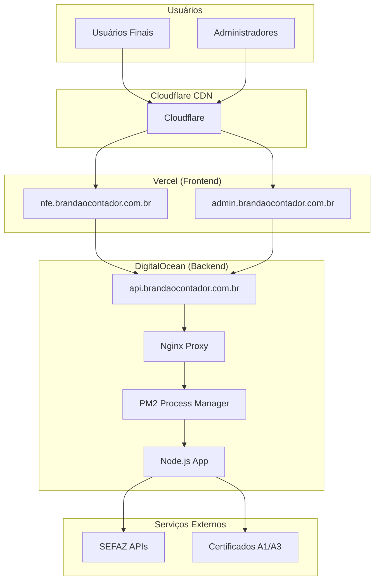

# Arquitetura Técnica e Deploy Automático

## 1. Arquitetura do Sistema

### 1.1 Visão Geral da Infraestrutura



### 1.2 Tecnologias por Camada

#### Frontend (Vercel)

- **Framework**: Next.js 14 + TypeScript
- **Styling**: Tailwind CSS
- **State Management**: React Hooks + Context
- **Authentication**: NextAuth.js
- **HTTP Client**: Fetch API nativo
- **Build Tool**: Next.js built-in

#### Backend (DigitalOcean)

- **Runtime**: Node.js 18.x
- **Framework**: Express.js
- **Process Manager**: PM2
- **Proxy**: Nginx
- **SSL**: Let's Encrypt (Certbot)
- **Logging**: Winston

## 2. Configuração de Deploy Automático

### 2.1 GitHub Repository Structure

```
brandaocontador-nfe/
├── .github/
│   └── workflows/
│       ├── deploy-frontend.yml
│       ├── deploy-backend.yml
│       └── test.yml
├── frontend/
│   ├── src/
│   ├── public/
│   ├── package.json
│   └── vercel.json
├── backend/
│   ├── app.js
│   ├── services/
│   ├── middleware/
│   └── package.json
└── docs/
```

### 2.2 GitHub Actions - Frontend Deploy

```yaml
# .github/workflows/deploy-frontend.yml
name: Deploy Frontend to Vercel

on:
  push:
    branches: [main]
    paths: ["frontend/**"]
  pull_request:
    branches: [main]
    paths: ["frontend/**"]

env:
  VERCEL_ORG_ID: ${{ secrets.VERCEL_ORG_ID }}
  VERCEL_PROJECT_ID: ${{ secrets.VERCEL_PROJECT_ID }}

jobs:
  test:
    runs-on: ubuntu-latest
    steps:
      - name: Checkout
        uses: actions/checkout@v4

      - name: Setup Node.js
        uses: actions/setup-node@v4
        with:
          node-version: "18"
          cache: "npm"
          cache-dependency-path: frontend/package-lock.json

      - name: Install dependencies
        run: |
          cd frontend
          npm ci

      - name: Run tests
        run: |
          cd frontend
          npm run test

      - name: Build application
        run: |
          cd frontend
          npm run build

  deploy:
    needs: test
    runs-on: ubuntu-latest
    if: github.ref == 'refs/heads/main'
    steps:
      - name: Checkout
        uses: actions/checkout@v4

      - name: Install Vercel CLI
        run: npm install --global vercel@latest

      - name: Pull Vercel Environment Information
        run: |
          cd frontend
          vercel pull --yes --environment=production --token=${{ secrets.VERCEL_TOKEN }}

      - name: Build Project Artifacts
        run: |
          cd frontend
          vercel build --prod --token=${{ secrets.VERCEL_TOKEN }}

      - name: Deploy Project Artifacts to Vercel
        run: |
          cd frontend
          vercel deploy --prebuilt --prod --token=${{ secrets.VERCEL_TOKEN }}
```

### 2.3 GitHub Actions - Backend Deploy

```yaml
# .github/workflows/deploy-backend.yml
name: Deploy Backend to DigitalOcean

on:
  push:
    branches: [main]
    paths: ["backend/**"]

jobs:
  test:
    runs-on: ubuntu-latest
    steps:
      - name: Checkout
        uses: actions/checkout@v4

      - name: Setup Node.js
        uses: actions/setup-node@v4
        with:
          node-version: "18"
          cache: "npm"
          cache-dependency-path: backend/package-lock.json

      - name: Install dependencies
        run: |
          cd backend
          npm ci

      - name: Run tests
        run: |
          cd backend
          npm test

  deploy:
    needs: test
    runs-on: ubuntu-latest
    if: github.ref == 'refs/heads/main'
    steps:
      - name: Deploy to DigitalOcean
        uses: appleboy/ssh-action@v0.1.7
        with:
          host: ${{ secrets.DO_HOST }}
          username: ${{ secrets.DO_USERNAME }}
          key: ${{ secrets.DO_SSH_KEY }}
          port: ${{ secrets.DO_PORT }}
          script: |
            cd /var/www/brandao-contador-api

            # Backup atual
            cp -r . ../backup-$(date +%Y%m%d-%H%M%S)

            # Atualizar código
            git pull origin main

            # Instalar dependências
            npm install --production

            # Reiniciar aplicação
            pm2 restart brandao-contador-api

            # Verificar status
            pm2 status

            # Salvar configuração PM2
            pm2 save

            # Verificar se aplicação está respondendo
            sleep 5
            curl -f http://localhost:3001/status || exit 1
```

### 2.4 Configuração de Secrets no GitHub

#### Secrets Necessários

```
# Vercel
VERCEL_TOKEN=your-vercel-token
VERCEL_ORG_ID=your-organization-id
VERCEL_PROJECT_ID=your-project-id

# DigitalOcean
DO_HOST=your-server-ip
DO_USERNAME=root
DO_SSH_KEY=your-private-ssh-key
DO_PORT=22

# Notificações (opcional)
SLACK_WEBHOOK=your-slack-webhook
DISCORD_WEBHOOK=your-discord-webhook
```

## 3. Configuração do Servidor DigitalOcean

### 3.1 Setup Inicial do Servidor

```bash
#!/bin/bash
# setup-server.sh

# Atualizar sistema
sudo apt update && sudo apt upgrade -y

# Instalar dependências
sudo apt install -y curl wget git nginx certbot python3-certbot-nginx

# Instalar Node.js
curl -fsSL https://deb.nodesource.com/setup_18.x | sudo -E bash -
sudo apt-get install -y nodejs

# Instalar PM2
sudo npm install -g pm2

# Configurar PM2 para iniciar no boot
pm2 startup
sudo env PATH=$PATH:/usr/bin /usr/lib/node_modules/pm2/bin/pm2 startup systemd -u $USER --hp $HOME

# Criar diretório da aplicação
sudo mkdir -p /var/www/brandao-contador-api
sudo chown $USER:$USER /var/www/brandao-contador-api

# Configurar firewall
sudo ufw allow OpenSSH
sudo ufw allow 'Nginx Full'
sudo ufw --force enable
```

### 3.2 Configuração Nginx

```nginx
# /etc/nginx/sites-available/api.brandaocontador.com.br
server {
    listen 80;
    server_name api.brandaocontador.com.br;
    return 301 https://$server_name$request_uri;
}

server {
    listen 443 ssl http2;
    server_name api.brandaocontador.com.br;

    # SSL Configuration
    ssl_certificate /etc/letsencrypt/live/api.brandaocontador.com.br/fullchain.pem;
    ssl_certificate_key /etc/letsencrypt/live/api.brandaocontador.com.br/privkey.pem;
    ssl_protocols TLSv1.2 TLSv1.3;
    ssl_ciphers ECDHE-RSA-AES256-GCM-SHA512:DHE-RSA-AES256-GCM-SHA512:ECDHE-RSA-AES256-GCM-SHA384:DHE-RSA-AES256-GCM-SHA384;
    ssl_prefer_server_ciphers off;
    ssl_session_cache shared:SSL:10m;
    ssl_session_timeout 10m;

    # Security Headers
    add_header X-Frame-Options DENY;
    add_header X-Content-Type-Options nosniff;
    add_header X-XSS-Protection "1; mode=block";
    add_header Strict-Transport-Security "max-age=31536000; includeSubDomains" always;

    # Rate Limiting
    limit_req_zone $binary_remote_addr zone=api:10m rate=10r/s;
    limit_req zone=api burst=20 nodelay;

    # Proxy Configuration
    location / {
        proxy_pass http://localhost:3001;
        proxy_http_version 1.1;
        proxy_set_header Upgrade $http_upgrade;
        proxy_set_header Connection 'upgrade';
        proxy_set_header Host $host;
        proxy_set_header X-Real-IP $remote_addr;
        proxy_set_header X-Forwarded-For $proxy_add_x_forwarded_for;
        proxy_set_header X-Forwarded-Proto $scheme;
        proxy_cache_bypass $http_upgrade;

        # Timeouts
        proxy_connect_timeout 60s;
        proxy_send_timeout 60s;
        proxy_read_timeout 60s;
    }

    # Health Check
    location /health {
        access_log off;
        return 200 "healthy\n";
        add_header Content-Type text/plain;
    }
}
```

### 3.3 Configuração PM2

```javascript
// ecosystem.config.js
module.exports = {
  apps: [
    {
      name: "brandao-contador-api",
      script: "app.js",
      instances: "max",
      exec_mode: "cluster",
      env: {
        NODE_ENV: "production",
        PORT: 3001,
      },
      env_production: {
        NODE_ENV: "production",
        PORT: 3001,
      },
      error_file: "./logs/err.log",
      out_file: "./logs/out.log",
      log_file: "./logs/combined.log",
      time: true,
      max_memory_restart: "1G",
      node_args: "--max-old-space-size=1024",
      watch: false,
      ignore_watch: ["node_modules", "logs"],
      max_restarts: 10,
      min_uptime: "10s",
    },
  ],
};
```

## 4. Configuração de Domínios

### 4.1 DNS Configuration

```
# Configuração DNS no provedor de domínio

# Frontend (Vercel)
nfe.brandaocontador.com.br    CNAME    cname.vercel-dns.com
admin.brandaocontador.com.br  CNAME    cname.vercel-dns.com

# Backend (DigitalOcean)
api.brandaocontador.com.br    A        YOUR_DIGITALOCEAN_IP

# Opcional: Cloudflare
# Se usar Cloudflare, apontar para os IPs do Cloudflare
```

### 4.2 Vercel Domain Configuration

```json
// vercel.json
{
  "domains": ["nfe.brandaocontador.com.br", "admin.brandaocontador.com.br"],
  "routes": [
    {
      "src": "/(.*)",
      "dest": "/",
      "headers": {
        "X-Frame-Options": "DENY",
        "X-Content-Type-Options": "nosniff"
      }
    }
  ],
  "functions": {
    "app/api/**/*.js": {
      "maxDuration": 30
    }
  }
}
```

## 5. Monitoramento e Alertas

### 5.1 Health Checks

```javascript
// health-check.js
const express = require("express");
const app = express();

// Health check endpoint
app.get("/health", (req, res) => {
  const healthCheck = {
    uptime: process.uptime(),
    message: "OK",
    timestamp: Date.now(),
    env: process.env.NODE_ENV,
    version: process.env.npm_package_version,
  };

  res.status(200).json(healthCheck);
});

// Readiness check
app.get("/ready", async (req, res) => {
  try {
    // Verificar conexões essenciais
    // await checkDatabase();
    // await checkExternalServices();

    res.status(200).json({ status: "ready" });
  } catch (error) {
    res.status(503).json({ status: "not ready", error: error.message });
  }
});
```

### 5.2 Logging Configuration

```javascript
// logger.js
const winston = require("winston");

const logger = winston.createLogger({
  level: "info",
  format: winston.format.combine(
    winston.format.timestamp(),
    winston.format.errors({ stack: true }),
    winston.format.json(),
  ),
  defaultMeta: { service: "brandao-contador-api" },
  transports: [
    new winston.transports.File({ filename: "logs/error.log", level: "error" }),
    new winston.transports.File({ filename: "logs/combined.log" }),
    new winston.transports.Console({
      format: winston.format.simple(),
    }),
  ],
});

module.exports = logger;
```

## 6. Backup e Recovery

### 6.1 Script de Backup Automático

```bash
#!/bin/bash
# backup.sh

BACKUP_DIR="/var/backups/brandao-contador"
DATE=$(date +%Y%m%d_%H%M%S)
APP_DIR="/var/www/brandao-contador-api"

# Criar diretório de backup
mkdir -p $BACKUP_DIR

# Backup da aplicação
tar -czf $BACKUP_DIR/app_$DATE.tar.gz -C $APP_DIR .

# Backup dos logs
tar -czf $BACKUP_DIR/logs_$DATE.tar.gz /var/log/nginx /var/www/brandao-contador-api/logs

# Backup dos certificados SSL
sudo tar -czf $BACKUP_DIR/ssl_$DATE.tar.gz /etc/letsencrypt

# Manter apenas os últimos 7 dias
find $BACKUP_DIR -name "*.tar.gz" -mtime +7 -delete

echo "Backup completed: $DATE"
```

### 6.2 Cron Job para Backup

```bash
# Adicionar ao crontab
# crontab -e

# Backup diário às 2:00 AM
0 2 * * * /var/www/brandao-contador-api/scripts/backup.sh

# Renovação SSL automática
0 12 * * * /usr/bin/certbot renew --quiet
```

## 7. Troubleshooting Guide

### 7.1 Comandos de Diagnóstico

```bash
# Verificar status dos serviços
sudo systemctl status nginx
pm2 status
pm2 logs brandao-contador-api --lines 50

# Verificar conectividade
curl -I https://api.brandaocontador.com.br/health
ping api.brandaocontador.com.br

# Verificar certificados SSL
openssl s_client -connect api.brandaocontador.com.br:443 -servername api.brandaocontador.com.br

# Verificar uso de recursos
top
df -h
free -m
```

### 7.2 Procedimentos de Recovery

```bash
# Restaurar backup
cd /var/www
sudo tar -xzf /var/backups/brandao-contador/app_YYYYMMDD_HHMMSS.tar.gz

# Reiniciar serviços
pm2 restart brandao-contador-api
sudo systemctl restart nginx

# Verificar funcionamento
curl https://api.brandaocontador.com.br/health
```

Esta documentação técnica fornece uma base sólida para manter e evoluir o sistema com deploy automático e monitoramento adequado.
