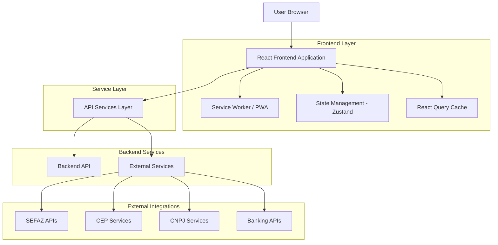
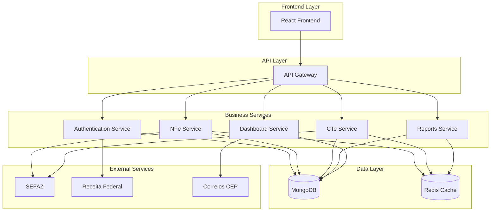
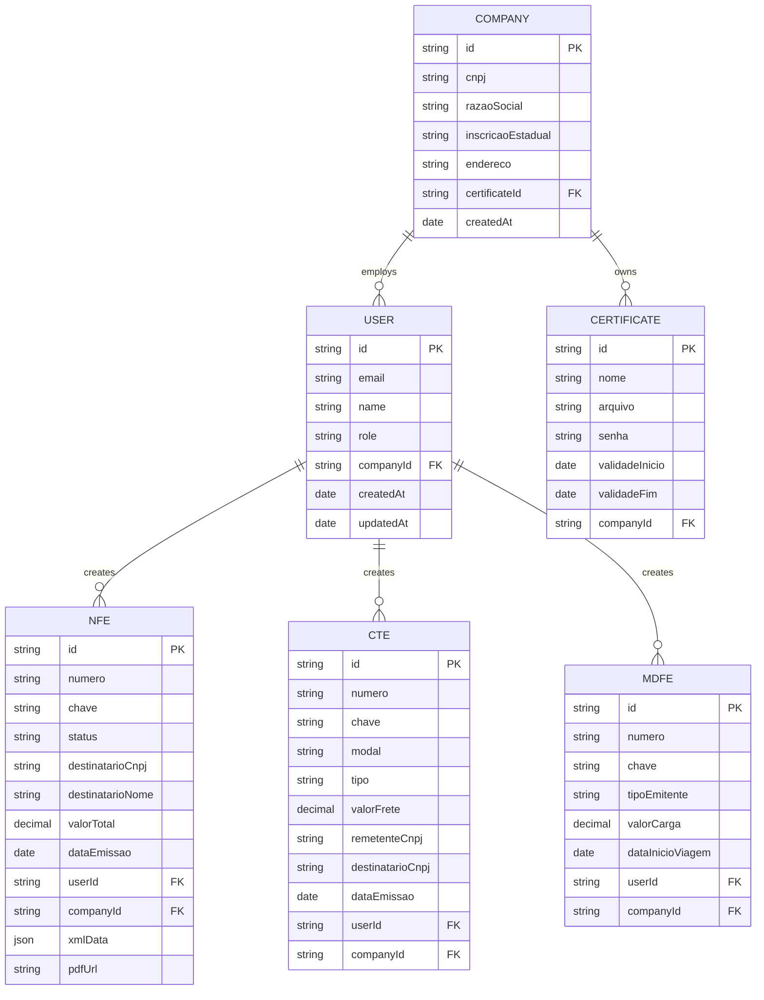

# ARQUITETURA TÉCNICA - FRONTEND NFE MODERNIZADO

## 1. Architecture design



## 2. Technology Description

- **Frontend**: React@18 + TypeScript@5 + Vite@5
- **UI Framework**: TailwindCSS@3 + Radix UI + Framer Motion
- **State Management**: Zustand + React Query (TanStack Query)
- **Forms**: React Hook Form + Zod validation
- **Charts**: Recharts + Chart.js
- **Icons**: Lucide React + Heroicons
- **Date**: date-fns
- **HTTP Client**: Axios
- **PWA**: Vite PWA Plugin
- **Testing**: Vitest + React Testing Library
- **Build**: Vite + TypeScript + ESLint + Prettier

## 3. Route definitions

| Route                        | Purpose                                       |
| ---------------------------- | --------------------------------------------- |
| `/`                          | Redirect to dashboard or login                |
| `/login`                     | User authentication page                      |
| `/cadastro`                  | User registration page                        |
| `/dashboard`                 | Executive dashboard with metrics and overview |
| `/emitir-nfe`                | NFe emission wizard                           |
| `/emitir-cte`                | CTe emission wizard                           |
| `/emitir-mdfe`               | MDFe emission wizard                          |
| `/emitir-nfce`               | NFCe emission wizard                          |
| `/consultar/:tipo/:numero`   | Document consultation and details             |
| `/historico`                 | Document history with filters and search      |
| `/relatorios`                | Advanced reports and analytics                |
| `/relatorios/executivo`      | Executive dashboard reports                   |
| `/relatorios/fiscal`         | Fiscal reports and compliance                 |
| `/clientes`                  | Customer management                           |
| `/produtos`                  | Product/service catalog                       |
| `/configuracoes`             | System settings and preferences               |
| `/configuracoes/empresa`     | Company profile settings                      |
| `/configuracoes/certificado` | Digital certificate management                |
| `/configuracoes/usuarios`    | User management (admin only)                  |
| `/status`                    | System status and health monitoring           |
| `/ajuda`                     | Help and documentation                        |

## 4. API definitions

### 4.1 Core API

**Authentication**

```
POST /api/auth/login
```

Request:
| Param Name | Param Type | isRequired | Description |
|------------|------------|------------|-------------|
| email | string | true | User email address |
| password | string | true | User password |

Response:
| Param Name | Param Type | Description |
|------------|------------|-------------|
| token | string | JWT authentication token |
| user | User | User profile data |
| permissions | string[] | User permissions array |

**NFe Emission**

```
POST /api/nfe/emitir
```

Request:
| Param Name | Param Type | isRequired | Description |
|------------|------------|------------|-------------|
| destinatario | Destinatario | true | Recipient data |
| itens | Item[] | true | Invoice items |
| impostos | Impostos | true | Tax calculations |
| transporte | Transporte | false | Transport data |

Response:
| Param Name | Param Type | Description |
|------------|------------|-------------|
| numero | string | NFe number |
| chave | string | NFe access key |
| status | string | Emission status |
| xml | string | Generated XML |
| pdf | string | DANFE PDF URL |

**Dashboard Metrics**

```
GET /api/dashboard/metrics
```

Response:
| Param Name | Param Type | Description |
|------------|------------|-------------|
| nfesHoje | number | NFes issued today |
| faturamentoMes | number | Monthly revenue |
| pendentes | number | Pending documents |
| taxaSucesso | number | Success rate percentage |

Example:

```json
{
  "email": "usuario@empresa.com",
  "password": "senha123"
}
```

## 5. Server architecture diagram



## 6. Data model

### 6.1 Data model definition



### 6.2 Data Definition Language

**User Table (users)**

```sql
-- create table
CREATE TABLE users (
    id UUID PRIMARY KEY DEFAULT gen_random_uuid(),
    email VARCHAR(255) UNIQUE NOT NULL,
    password_hash VARCHAR(255) NOT NULL,
    name VARCHAR(100) NOT NULL,
    role VARCHAR(20) DEFAULT 'user' CHECK (role IN ('admin', 'user', 'viewer')),
    company_id UUID REFERENCES companies(id),
    is_active BOOLEAN DEFAULT true,
    last_login TIMESTAMP WITH TIME ZONE,
    created_at TIMESTAMP WITH TIME ZONE DEFAULT NOW(),
    updated_at TIMESTAMP WITH TIME ZONE DEFAULT NOW()
);

-- create indexes
CREATE INDEX idx_users_email ON users(email);
CREATE INDEX idx_users_company_id ON users(company_id);
CREATE INDEX idx_users_role ON users(role);
```

**Company Table (companies)**

```sql
-- create table
CREATE TABLE companies (
    id UUID PRIMARY KEY DEFAULT gen_random_uuid(),
    cnpj VARCHAR(14) UNIQUE NOT NULL,
    razao_social VARCHAR(255) NOT NULL,
    nome_fantasia VARCHAR(255),
    inscricao_estadual VARCHAR(20),
    inscricao_municipal VARCHAR(20),
    endereco JSONB NOT NULL,
    contato JSONB,
    regime_tributario VARCHAR(20) DEFAULT 'simples_nacional',
    certificate_id UUID REFERENCES certificates(id),
    is_active BOOLEAN DEFAULT true,
    created_at TIMESTAMP WITH TIME ZONE DEFAULT NOW(),
    updated_at TIMESTAMP WITH TIME ZONE DEFAULT NOW()
);

-- create indexes
CREATE INDEX idx_companies_cnpj ON companies(cnpj);
CREATE INDEX idx_companies_active ON companies(is_active);
```

**NFe Table (nfes)**

```sql
-- create table
CREATE TABLE nfes (
    id UUID PRIMARY KEY DEFAULT gen_random_uuid(),
    numero VARCHAR(20) NOT NULL,
    serie VARCHAR(5) DEFAULT '1',
    chave VARCHAR(44) UNIQUE,
    status VARCHAR(20) DEFAULT 'rascunho',
    tipo_operacao VARCHAR(20) DEFAULT 'saida',
    destinatario JSONB NOT NULL,
    itens JSONB NOT NULL,
    impostos JSONB,
    transporte JSONB,
    valor_total DECIMAL(15,2) NOT NULL,
    valor_impostos DECIMAL(15,2) DEFAULT 0,
    data_emissao TIMESTAMP WITH TIME ZONE,
    data_vencimento DATE,
    observacoes TEXT,
    xml_content TEXT,
    pdf_url VARCHAR(500),
    protocolo_autorizacao VARCHAR(50),
    user_id UUID REFERENCES users(id),
    company_id UUID REFERENCES companies(id),
    created_at TIMESTAMP WITH TIME ZONE DEFAULT NOW(),
    updated_at TIMESTAMP WITH TIME ZONE DEFAULT NOW()
);

-- create indexes
CREATE INDEX idx_nfes_numero ON nfes(numero, serie, company_id);
CREATE INDEX idx_nfes_chave ON nfes(chave);
CREATE INDEX idx_nfes_status ON nfes(status);
CREATE INDEX idx_nfes_data_emissao ON nfes(data_emissao DESC);
CREATE INDEX idx_nfes_company_id ON nfes(company_id);
CREATE INDEX idx_nfes_user_id ON nfes(user_id);
CREATE INDEX idx_nfes_destinatario_cnpj ON nfes USING GIN ((destinatario->>'cnpj'));
```

**CTe Table (ctes)**

```sql
-- create table
CREATE TABLE ctes (
    id UUID PRIMARY KEY DEFAULT gen_random_uuid(),
    numero VARCHAR(20) NOT NULL,
    serie VARCHAR(5) DEFAULT '1',
    chave VARCHAR(44) UNIQUE,
    status VARCHAR(20) DEFAULT 'rascunho',
    modal VARCHAR(20) DEFAULT 'rodoviario',
    tipo VARCHAR(20) DEFAULT 'normal',
    servico VARCHAR(20) DEFAULT 'normal',
    remetente JSONB NOT NULL,
    destinatario JSONB NOT NULL,
    expedidor JSONB,
    recebedor JSONB,
    valores JSONB NOT NULL,
    impostos JSONB,
    carga JSONB NOT NULL,
    documentos JSONB,
    valor_frete DECIMAL(15,2) NOT NULL,
    data_emissao TIMESTAMP WITH TIME ZONE,
    xml_content TEXT,
    pdf_url VARCHAR(500),
    protocolo_autorizacao VARCHAR(50),
    user_id UUID REFERENCES users(id),
    company_id UUID REFERENCES companies(id),
    created_at TIMESTAMP WITH TIME ZONE DEFAULT NOW(),
    updated_at TIMESTAMP WITH TIME ZONE DEFAULT NOW()
);

-- create indexes
CREATE INDEX idx_ctes_numero ON ctes(numero, serie, company_id);
CREATE INDEX idx_ctes_chave ON ctes(chave);
CREATE INDEX idx_ctes_status ON ctes(status);
CREATE INDEX idx_ctes_modal ON ctes(modal);
CREATE INDEX idx_ctes_data_emissao ON ctes(data_emissao DESC);
CREATE INDEX idx_ctes_company_id ON ctes(company_id);
```

**Certificates Table (certificates)**

```sql
-- create table
CREATE TABLE certificates (
    id UUID PRIMARY KEY DEFAULT gen_random_uuid(),
    nome VARCHAR(255) NOT NULL,
    arquivo_path VARCHAR(500) NOT NULL,
    senha_hash VARCHAR(255) NOT NULL,
    validade_inicio DATE NOT NULL,
    validade_fim DATE NOT NULL,
    subject_name VARCHAR(255),
    issuer_name VARCHAR(255),
    serial_number VARCHAR(100),
    is_active BOOLEAN DEFAULT true,
    company_id UUID REFERENCES companies(id),
    created_at TIMESTAMP WITH TIME ZONE DEFAULT NOW(),
    updated_at TIMESTAMP WITH TIME ZONE DEFAULT NOW()
);

-- create indexes
CREATE INDEX idx_certificates_company_id ON certificates(company_id);
CREATE INDEX idx_certificates_validade_fim ON certificates(validade_fim);
CREATE INDEX idx_certificates_active ON certificates(is_active);
```

**Dashboard Metrics View**

```sql
-- create view for dashboard metrics
CREATE OR REPLACE VIEW dashboard_metrics AS
SELECT
    c.id as company_id,
    COUNT(CASE WHEN n.data_emissao::date = CURRENT_DATE THEN 1 END) as nfes_hoje,
    COUNT(CASE WHEN n.data_emissao >= date_trunc('month', CURRENT_DATE) THEN 1 END) as nfes_mes,
    SUM(CASE WHEN n.data_emissao >= date_trunc('month', CURRENT_DATE) THEN n.valor_total ELSE 0 END) as faturamento_mes,
    COUNT(CASE WHEN n.status = 'rascunho' THEN 1 END) as pendentes,
    ROUND(
        COUNT(CASE WHEN n.status = 'autorizada' THEN 1 END) * 100.0 /
        NULLIF(COUNT(CASE WHEN n.status != 'rascunho' THEN 1 END), 0),
        2
    ) as taxa_sucesso
FROM companies c
LEFT JOIN nfes n ON c.id = n.company_id
WHERE c.is_active = true
GROUP BY c.id;
```

**Initial Data**

```sql
-- init data
INSERT INTO companies (cnpj, razao_social, nome_fantasia, endereco, regime_tributario) VALUES
('12345678000195', 'Empresa Exemplo LTDA', 'Exemplo',
 '{"logradouro": "Rua Exemplo, 123", "bairro": "Centro", "cidade": "São Paulo", "uf": "SP", "cep": "01000000"}',
 'simples_nacional');

INSERT INTO users (email, password_hash, name, role, company_id) VALUES
('admin@exemplo.com', '$2b$10$hash_example', 'Administrador', 'admin',
 (SELECT id FROM companies WHERE cnpj = '12345678000195'));
```

---

**🎯 RESULTADO**: Uma arquitetura **robusta, escalável e moderna** que suporta todos os documentos fiscais com performance e segurança empresarial.
