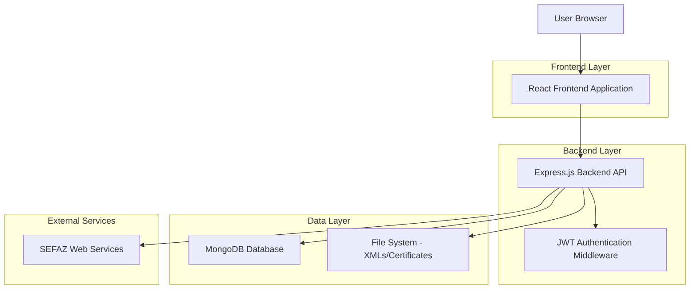
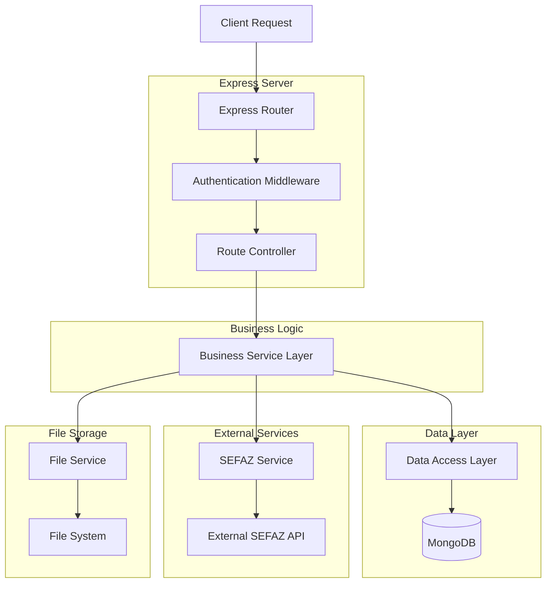
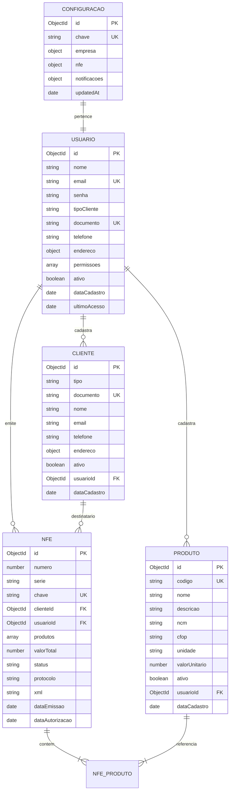

# Arquitetura Técnica - Backend NFe Reestruturado

## 1. Architecture design



## 2. Technology Description

- **Frontend**: React@18 + tailwindcss@3 + vite + axios
- **Backend**: Express@4 + mongoose@7 + jsonwebtoken@9 + bcryptjs@2
- **Database**: MongoDB (via Mongoose ODM)
- **Authentication**: JWT + bcrypt
- **SEFAZ Integration**: soap@1.0 + xmldom@0.6
- **Process Manager**: PM2

## 3. Route definitions

| Route                     | Purpose                                    |
| ------------------------- | ------------------------------------------ |
| /api/auth/login           | Autenticação de usuário, retorna JWT token |
| /api/auth/register        | Registro de novo usuário                   |
| /api/auth/validate        | Validação de token JWT                     |
| /api/emitente/config      | Configuração dos dados do emitente         |
| /api/nfe/emitir           | Emissão de Nota Fiscal Eletrônica          |
| /api/cte/emitir           | Emissão de Conhecimento de Transporte      |
| /api/mdfe/emitir          | Emissão de Manifesto de Documentos Fiscais |
| /api/nfe/consultar/:chave | Consulta NFe por chave de acesso           |
| /api/nfe/cancelar         | Cancelamento de NFe                        |
| /api/clientes             | CRUD de clientes                           |
| /api/produtos             | CRUD de produtos                           |
| /api/relatorios           | Relatórios e consultas                     |
| /api/sistema/status       | Health check e status do sistema           |

## 4. API definitions

### 4.1 Core API

**Autenticação de usuário**

```
POST /api/auth/login
```

Request:
| Param Name| Param Type | isRequired | Description |
|-----------|-------------|-------------|-------------|
| email | string | true | Email do usuário |
| senha | string | true | Senha do usuário |

Response:
| Param Name| Param Type | Description |
|-----------|-------------|-------------|
| sucesso | boolean | Status da operação |
| token | string | JWT token para autenticação |
| usuario | object | Dados do usuário logado |

Example:

```json
{
  "email": "usuario@empresa.com",
  "senha": "senha123"
}
```

**Emissão de NFe**

```
POST /api/nfe/emitir
```

Request:
| Param Name| Param Type | isRequired | Description |
|-----------|-------------|-------------|-------------|
| cliente | object | true | Dados do cliente/destinatário |
| produtos | array | true | Lista de produtos/serviços |
| observacoes | string | false | Observações adicionais |

Response:
| Param Name| Param Type | Description |
|-----------|-------------|-------------|
| sucesso | boolean | Status da emissão |
| chave | string | Chave de acesso da NFe |
| protocolo | string | Protocolo de autorização SEFAZ |
| xml | string | XML da NFe autorizada |

**Configuração do Emitente**

```
GET /api/emitente/config
POST /api/emitente/config
```

Request (POST):
| Param Name| Param Type | isRequired | Description |
|-----------|-------------|-------------|-------------|
| emitente | object | true | Dados completos do emitente |

Response:
| Param Name| Param Type | Description |
|-----------|-------------|-------------|
| sucesso | boolean | Status da operação |
| emitente | object | Dados do emitente configurado |
| configurado | boolean | Se emitente está configurado |

### 4.2 TypeScript Interfaces

```typescript
interface Usuario {
  id: string;
  nome: string;
  email: string;
  tipoCliente: "cpf" | "cnpj";
  documento: string;
  ativo: boolean;
  permissoes: string[];
  dataCadastro: Date;
}

interface Emitente {
  nome: string;
  cnpj: string;
  inscricaoEstadual: string;
  inscricaoMunicipal?: string;
  regimeTributario: number;
  endereco: Endereco;
}

interface Endereco {
  cep: string;
  logradouro: string;
  numero: string;
  complemento?: string;
  bairro: string;
  municipio: string;
  uf: string;
  codigoMunicipio?: string;
}

interface Cliente {
  tipo: "cpf" | "cnpj";
  documento: string;
  nome: string;
  email?: string;
  telefone?: string;
  endereco: Endereco;
}

interface Produto {
  codigo: string;
  nome: string;
  ncm: string;
  cfop: string;
  unidade: string;
  quantidade: number;
  valorUnitario: number;
  valorTotal: number;
}

interface NFe {
  numero: number;
  serie: string;
  chave: string;
  cliente: Cliente;
  produtos: Produto[];
  valorTotal: number;
  status: "autorizada" | "cancelada" | "denegada";
  protocolo?: string;
  dataEmissao: Date;
}
```

## 5. Server architecture diagram



## 6. Data model

### 6.1 Data model definition



### 6.2 Data Definition Language

**Usuários**

```javascript
// Criar coleção de usuários
db.createCollection("usuarios", {
  validator: {
    $jsonSchema: {
      bsonType: "object",
      required: ["nome", "email", "senha", "tipoCliente"],
      properties: {
        nome: { bsonType: "string", maxLength: 100 },
        email: { bsonType: "string", pattern: "^[^@]+@[^@]+\.[^@]+$" },
        senha: { bsonType: "string", minLength: 6 },
        tipoCliente: { enum: ["cpf", "cnpj"] },
        documento: { bsonType: "string" },
        ativo: { bsonType: "bool" },
        permissoes: { bsonType: "array" },
      },
    },
  },
});

// Índices para usuários
db.usuarios.createIndex({ email: 1 }, { unique: true });
db.usuarios.createIndex({ documento: 1 }, { unique: true, sparse: true });
db.usuarios.createIndex({ ativo: 1 });
```

**Clientes**

```javascript
// Criar coleção de clientes
db.createCollection("clientes", {
  validator: {
    $jsonSchema: {
      bsonType: "object",
      required: ["tipo", "documento", "nome"],
      properties: {
        tipo: { enum: ["cpf", "cnpj"] },
        documento: { bsonType: "string" },
        nome: { bsonType: "string", maxLength: 200 },
        email: { bsonType: "string", pattern: "^[^@]+@[^@]+\.[^@]+$" },
        ativo: { bsonType: "bool" },
      },
    },
  },
});

// Índices para clientes
db.clientes.createIndex({ documento: 1 }, { unique: true });
db.clientes.createIndex({ usuarioId: 1 });
db.clientes.createIndex({ nome: 1 });
```

**Produtos**

```javascript
// Criar coleção de produtos
db.createCollection("produtos", {
  validator: {
    $jsonSchema: {
      bsonType: "object",
      required: ["nome", "ncm", "cfop", "unidade"],
      properties: {
        codigo: { bsonType: "string", maxLength: 50 },
        nome: { bsonType: "string", maxLength: 150 },
        ncm: { bsonType: "string", pattern: "^[0-9]{2,8}$" },
        cfop: { bsonType: "string", pattern: "^[0-9]{4}$" },
        valorUnitario: { bsonType: "number", minimum: 0 },
      },
    },
  },
});

// Índices para produtos
db.produtos.createIndex({ codigo: 1 }, { unique: true, sparse: true });
db.produtos.createIndex({ usuarioId: 1 });
db.produtos.createIndex({ ativo: 1 });
```

**NFes**

```javascript
// Criar coleção de NFes
db.createCollection("nfes", {
  validator: {
    $jsonSchema: {
      bsonType: "object",
      required: ["numero", "serie", "chave", "clienteId", "usuarioId"],
      properties: {
        numero: { bsonType: "number", minimum: 1 },
        serie: { bsonType: "string" },
        chave: { bsonType: "string", minLength: 44, maxLength: 44 },
        status: { enum: ["autorizada", "cancelada", "denegada", "pendente"] },
        valorTotal: { bsonType: "number", minimum: 0 },
      },
    },
  },
});

// Índices para NFes
db.nfes.createIndex({ chave: 1 }, { unique: true });
db.nfes.createIndex({ usuarioId: 1 });
db.nfes.createIndex({ clienteId: 1 });
db.nfes.createIndex({ dataEmissao: -1 });
db.nfes.createIndex({ status: 1 });
```

**Configurações**

```javascript
// Criar coleção de configurações
db.createCollection("configuracoes", {
  validator: {
    $jsonSchema: {
      bsonType: "object",
      required: ["chave"],
      properties: {
        chave: { bsonType: "string" },
        empresa: { bsonType: "object" },
        nfe: { bsonType: "object" },
        notificacoes: { bsonType: "object" },
      },
    },
  },
});

// Índices para configurações
db.configuracoes.createIndex({ chave: 1 }, { unique: true });
```

**Dados Iniciais**

```javascript
// Inserir configuração padrão
db.configuracoes.insertOne({
  chave: "padrao",
  empresa: {
    razaoSocial: "",
    nomeFantasia: "",
    cnpj: "",
    inscricaoEstadual: "",
    email: "",
    telefone: "",
    endereco: {
      cep: "",
      logradouro: "",
      numero: "",
      bairro: "",
      municipio: "",
      uf: "",
    },
  },
  nfe: {
    ambiente: "homologacao",
    serie: "1",
    numeracaoInicial: 1,
    certificadoDigital: {
      arquivo: "",
      senha: "",
      status: "nao_configurado",
    },
  },
  notificacoes: {
    emailNFeEmitida: true,
    emailNFeCancelada: true,
    emailErroEmissao: true,
  },
  createdAt: new Date(),
  updatedAt: new Date(),
});

// Inserir usuário administrador padrão
db.usuarios.insertOne({
  nome: "Administrador",
  email: "admin@brandaocontador.com.br",
  senha: "$2a$10$exemplo_hash_bcrypt", // Senha: admin123
  tipoCliente: "cnpj",
  documento: "00000000000191",
  telefone: "67999999999",
  endereco: {
    cep: "79000000",
    logradouro: "Rua Exemplo",
    numero: "123",
    bairro: "Centro",
    cidade: "Campo Grande",
    uf: "MS",
  },
  permissoes: [
    "admin",
    "nfe_emitir",
    "nfe_consultar",
    "cte_emitir",
    "mdfe_emitir",
  ],
  ativo: true,
  dataCadastro: new Date(),
  ultimoAcesso: new Date(),
});
```

## 7. Configuração de Deploy

### 7.1 Variáveis de Ambiente

```env
# Aplicação
NODE_ENV=production
PORT=3001
JWT_SECRET=sua_chave_jwt_super_secreta_aqui
JWT_EXPIRES_IN=1h
JWT_REFRESH_EXPIRES_IN=7d

# Banco de Dados
MONGODB_URI=mongodb://localhost:27017/brandaocontador_nfe

# SEFAZ
AMBIENTE=1
UF=MS
CNPJ_EMITENTE=12345678000195
CERT_PATH=./certificados/certificado.pfx
CERT_PASS=senha_do_certificado

# Configurações
SIMULATION_MODE=false
SAVE_XML_FILES=true
XML_OUTPUT_DIR=./xmls
TIMEOUT=30000
MAX_FILE_SIZE=10MB

# Logs
LOG_LEVEL=info
LOG_FILE=./logs/app.log
```

### 7.2 PM2 Configuration

```javascript
module.exports = {
  apps: [
    {
      name: "brandaocontador-nfe-backend",
      script: "./app.js",
      instances: 1,
      autorestart: true,
      watch: false,
      max_memory_restart: "1G",
      env_file: ".env",
      error_file: "./logs/pm2-error.log",
      out_file: "./logs/pm2-out.log",
      log_file: "./logs/pm2-combined.log",
      time: true,
    },
  ],
};
```

### 7.3 Health Check Endpoint

```javascript
// GET /api/sistema/status
{
  "status": "healthy",
  "timestamp": "2024-01-15T10:30:00Z",
  "services": {
    "database": "connected",
    "sefaz": "available",
    "certificate": "valid"
  },
  "version": "1.0.0",
  "uptime": 3600
}
```

---

**Conclusão**: Esta arquitetura técnica fornece uma base sólida, escalável e maintível para o sistema de emissão fiscal, eliminando a complexidade desnecessária e focando em funcionalidade robusta.
