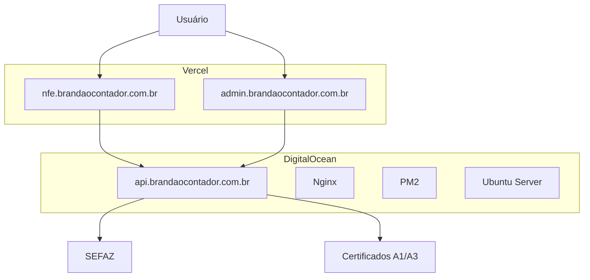

# Documentação Completa - Sistema Brandão Contador NFe

## 1. Visão Geral do Projeto

O Sistema Brandão Contador NFe é uma aplicação completa para emissão e gestão de Notas Fiscais Eletrônicas, composta por três componentes principais:

- **Frontend Principal**: `nfe.brandaocontador.com.br` - Interface do usuário para emissão de NFe
- **Backend API**: `api.brandaocontador.com.br` - Serviços de backend e integração com SEFAZ
- **Painel Admin**: `admin.brandaocontador.com.br` - Interface administrativa

### Tecnologias Utilizadas

#### Frontend

- **Framework**: Next.js 14 com TypeScript
- **Styling**: Tailwind CSS
- **Autenticação**: NextAuth.js
- **Deploy**: Vercel
- **Repositório**: GitHub

#### Backend

- **Runtime**: Node.js com Express
- **Certificados**: Suporte a certificados A1/A3
- **Deploy**: DigitalOcean (Ubuntu)
- **Processo**: PM2
- **Proxy**: Nginx

## 2. Arquitetura do Sistema

### 2.1 Diagrama de Arquitetura



### 2.2 Fluxo de Dados

1. **Usuário** acessa o frontend via `nfe.brandaocontador.com.br`
2. **Frontend** faz requisições para `api.brandaocontador.com.br`
3. **Backend** processa dados e comunica com SEFAZ
4. **Resposta** retorna ao frontend com status da NFe

## 3. Configurações de Deploy

### 3.1 Frontend (Vercel)

#### Configuração Atual

- **Repositório**: Conectado ao GitHub
- **Branch Principal**: `main`
- **Build Command**: `npm run build`
- **Output Directory**: `.next`
- **Deploy Automático**: Ativado para push na main

#### Variáveis de Ambiente (Vercel)

```env
NEXT_PUBLIC_BACKEND_URL=https://api.brandaocontador.com.br
NEXTAUTH_URL=https://nfe.brandaocontador.com.br
NEXTAUTH_SECRET=your-secret-key
GOOGLE_CLIENT_ID=your-google-client-id
GOOGLE_CLIENT_SECRET=your-google-client-secret
FACEBOOK_CLIENT_ID=your-facebook-client-id
FACEBOOK_CLIENT_SECRET=your-facebook-client-secret
```

### 3.2 Backend (DigitalOcean)

#### Configuração do Servidor

- **OS**: Ubuntu 20.04 LTS
- **Node.js**: v18.x
- **PM2**: Gerenciador de processos
- **Nginx**: Proxy reverso
- **SSL**: Let's Encrypt (Certbot)

#### Estrutura de Diretórios

```
/var/www/brandao-contador-api/
├── app.js
├── package.json
├── ecosystem.config.js
├── certs/
├── services/
└── middleware/
```

#### Configuração PM2 (ecosystem.config.js)

```javascript
module.exports = {
  apps: [
    {
      name: "brandao-contador-api",
      script: "app.js",
      instances: "max",
      exec_mode: "cluster",
      env: {
        NODE_ENV: "production",
        PORT: 3001,
      },
      error_file: "./logs/err.log",
      out_file: "./logs/out.log",
      log_file: "./logs/combined.log",
      time: true,
    },
  ],
};
```

#### Configuração Nginx

```nginx
server {
    listen 80;
    server_name api.brandaocontador.com.br;
    return 301 https://$server_name$request_uri;
}

server {
    listen 443 ssl http2;
    server_name api.brandaocontador.com.br;

    ssl_certificate /etc/letsencrypt/live/api.brandaocontador.com.br/fullchain.pem;
    ssl_certificate_key /etc/letsencrypt/live/api.brandaocontador.com.br/privkey.pem;

    location / {
        proxy_pass http://localhost:3001;
        proxy_http_version 1.1;
        proxy_set_header Upgrade $http_upgrade;
        proxy_set_header Connection 'upgrade';
        proxy_set_header Host $host;
        proxy_set_header X-Real-IP $remote_addr;
        proxy_set_header X-Forwarded-For $proxy_add_x_forwarded_for;
        proxy_set_header X-Forwarded-Proto $scheme;
        proxy_cache_bypass $http_upgrade;
    }
}
```

## 4. Processo de CI/CD Automático

### 4.1 GitHub Actions para Frontend

Criar `.github/workflows/deploy-frontend.yml`:

```yaml
name: Deploy Frontend

on:
  push:
    branches: [main]
    paths: ["frontend/**"]

jobs:
  deploy:
    runs-on: ubuntu-latest
    steps:
      - uses: actions/checkout@v3

      - name: Setup Node.js
        uses: actions/setup-node@v3
        with:
          node-version: "18"
          cache: "npm"
          cache-dependency-path: frontend/package-lock.json

      - name: Install dependencies
        run: |
          cd frontend
          npm ci

      - name: Build
        run: |
          cd frontend
          npm run build

      - name: Deploy to Vercel
        uses: amondnet/vercel-action@v25
        with:
          vercel-token: ${{ secrets.VERCEL_TOKEN }}
          vercel-org-id: ${{ secrets.VERCEL_ORG_ID }}
          vercel-project-id: ${{ secrets.VERCEL_PROJECT_ID }}
          working-directory: ./frontend
```

### 4.2 GitHub Actions para Backend

Criar `.github/workflows/deploy-backend.yml`:

```yaml
name: Deploy Backend

on:
  push:
    branches: [main]
    paths: ["backend/**"]

jobs:
  deploy:
    runs-on: ubuntu-latest
    steps:
      - uses: actions/checkout@v3

      - name: Deploy to DigitalOcean
        uses: appleboy/ssh-action@v0.1.5
        with:
          host: ${{ secrets.DO_HOST }}
          username: ${{ secrets.DO_USERNAME }}
          key: ${{ secrets.DO_SSH_KEY }}
          script: |
            cd /var/www/brandao-contador-api
            git pull origin main
            npm install --production
            pm2 restart brandao-contador-api
            pm2 save
```

### 4.3 Secrets Necessários no GitHub

```
VERCEL_TOKEN=your-vercel-token
VERCEL_ORG_ID=your-org-id
VERCEL_PROJECT_ID=your-project-id
DO_HOST=your-digitalocean-ip
DO_USERNAME=root
DO_SSH_KEY=your-private-ssh-key
```

## 5. Configuração do Painel Admin

### 5.1 Estrutura do Admin

O painel admin está integrado no mesmo projeto frontend, mas com roteamento específico:

```
frontend/src/app/admin/
├── layout.tsx
├── page.tsx
├── users/
├── nfe/
└── settings/
```

### 5.2 Configuração de Subdomínio

No Vercel, configurar domínio personalizado:

- Adicionar `admin.brandaocontador.com.br`
- Configurar DNS CNAME apontando para Vercel
- Middleware para redirecionar rotas admin

### 5.3 Middleware de Roteamento

```typescript
// middleware.ts
import { NextResponse } from "next/server";
import type { NextRequest } from "next/server";

export function middleware(request: NextRequest) {
  const hostname = request.headers.get("host");

  if (hostname === "admin.brandaocontador.com.br") {
    return NextResponse.rewrite(new URL("/admin", request.url));
  }

  return NextResponse.next();
}
```

## 6. Melhorias e Otimizações

### 6.1 Performance

#### Frontend

- **Implementar**: React Query para cache de dados
- **Otimizar**: Imagens com Next.js Image
- **Adicionar**: Service Worker para cache offline
- **Configurar**: Bundle analyzer para otimização

#### Backend

- **Implementar**: Redis para cache
- **Adicionar**: Rate limiting
- **Otimizar**: Queries de banco de dados
- **Configurar**: Compression middleware

### 6.2 Segurança

#### Melhorias Recomendadas

- **CORS**: Configuração restritiva
- **Helmet**: Headers de segurança
- **Rate Limiting**: Proteção contra ataques
- **Input Validation**: Joi ou Zod
- **Logs**: Winston para auditoria

### 6.3 Monitoramento

#### Ferramentas Sugeridas

- **Uptime**: UptimeRobot ou Pingdom
- **Logs**: LogRocket ou Sentry
- **Performance**: New Relic ou DataDog
- **Alertas**: Slack ou Discord webhooks

## 7. Troubleshooting

### 7.1 Problemas Comuns

#### Frontend não carrega

```bash
# Verificar build no Vercel
vercel logs

# Verificar variáveis de ambiente
vercel env ls
```

#### Backend não responde

```bash
# Verificar status PM2
pm2 status

# Verificar logs
pm2 logs brandao-contador-api

# Reiniciar aplicação
pm2 restart brandao-contador-api
```

#### SSL/HTTPS problemas

```bash
# Renovar certificado
sudo certbot renew

# Verificar configuração Nginx
sudo nginx -t
sudo systemctl reload nginx
```

### 7.2 Comandos de Manutenção

#### Backup do Servidor

```bash
# Backup da aplicação
tar -czf backup-$(date +%Y%m%d).tar.gz /var/www/brandao-contador-api

# Backup dos certificados
sudo tar -czf certs-backup-$(date +%Y%m%d).tar.gz /etc/letsencrypt
```

#### Atualização do Sistema

```bash
# Atualizar pacotes
sudo apt update && sudo apt upgrade -y

# Atualizar Node.js
nvm install --lts
nvm use --lts

# Atualizar PM2
npm install -g pm2@latest
pm2 update
```

## 8. Checklist de Deploy

### 8.1 Antes do Deploy

- [ ] Testes locais passando
- [ ] Variáveis de ambiente configuradas
- [ ] Certificados válidos
- [ ] Backup realizado

### 8.2 Durante o Deploy

- [ ] Monitorar logs em tempo real
- [ ] Verificar status dos serviços
- [ ] Testar endpoints críticos

### 8.3 Após o Deploy

- [ ] Verificar funcionamento completo
- [ ] Testar emissão de NFe
- [ ] Confirmar logs sem erros
- [ ] Notificar equipe

## 9. Contatos e Suporte

### 9.1 Responsáveis

- **Desenvolvimento**: [Nome do desenvolvedor]
- **Infraestrutura**: [Nome do responsável]
- **Suporte**: [Contato de suporte]

### 9.2 Recursos

- **Repositório**: [Link do GitHub]
- **Vercel Dashboard**: [Link do Vercel]
- **DigitalOcean**: [Link do painel]
- **Documentação SEFAZ**: [Links relevantes]

---

**Última atualização**: $(date)
**Versão**: 1.0
**Autor**: Sistema Brandão Contador
