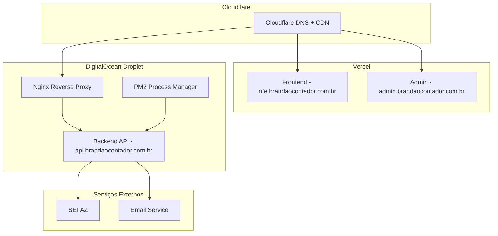

# PLANO COMPLETO DE IMPLEMENTAÇÃO E DEPLOY

## Sistema NFe Brandão Contador

---

## 📊 ANÁLISE DO ESTADO ATUAL

### ✅ O que está funcionando:

- **Backend**: Totalmente funcional em modo simulação
- **Estrutura XML NFe**: Corrigida e validada
- **Sistema de Logs**: Implementado e detalhado
- **Configurações**: Ambiente preparado (.env configurado)
- **Frontend Básico**: Next.js 15 com Tailwind CSS
- **Autenticação**: NextAuth.js configurado
- **Deploy Parcial**: Estrutura preparada

### ⚠️ Gaps Identificados:

#### 1. **Frontend Incompleto**

- Layout básico sem navegação completa
- Falta formulário de emissão de NFe
- Ausência de páginas de validação e histórico
- Dashboard com dados mockados
- Sem integração real com backend

#### 2. **Sistema de Autenticação**

- NextAuth configurado mas sem integração com backend
- Falta sistema de permissões (admin/contador/usuário)
- Ausência de middleware de autorização
- Sem gestão de API keys

#### 3. **Painel Administrativo**

- Não implementado
- Falta gestão de usuários
- Ausência de monitoramento em tempo real
- Sem configurações globais

#### 4. **Integração SEFAZ**

- Sistema em modo simulação
- Falta certificado digital válido
- Ausência de validações obrigatórias
- Sem retry automático para falhas

#### 5. **Deploy e Infraestrutura**

- Sem CI/CD automatizado
- Configurações de produção incompletas
- Falta SSL e domínios configurados
- Ausência de monitoramento

---

## 🚀 ROADMAP DE MELHORIAS

### FASE 1: Frontend Completo (2-3 semanas)

#### 1.1 Sistema de Navegação

```typescript
// Componentes a implementar:
- Navigation.tsx (menu principal)
- Sidebar.tsx (navegação lateral)
- Breadcrumb.tsx (navegação hierárquica)
- UserMenu.tsx (menu do usuário)
```

#### 1.2 Páginas Principais

```typescript
// Estrutura de páginas:
src/app/
├── dashboard/page.tsx          // ✅ Existente (melhorar)
├── nfe/
│   ├── emitir/page.tsx        // 🔴 Criar
│   ├── validar/page.tsx       // 🔴 Criar
│   ├── historico/page.tsx     // 🔴 Criar
│   └── [id]/page.tsx          // 🔴 Criar (detalhes)
├── configuracoes/page.tsx      // 🔴 Criar
├── admin/
│   ├── page.tsx               // 🔴 Criar
│   ├── usuarios/page.tsx      // 🔴 Criar
│   ├── sistema/page.tsx       // 🔴 Criar
│   └── logs/page.tsx          // 🔴 Criar
└── auth/
    ├── login/page.tsx         // 🔴 Criar
    └── register/page.tsx      // 🔴 Criar
```

#### 1.3 Componentes Essenciais

```typescript
// Componentes a desenvolver:
components/
├── forms/
│   ├── NFeForm.tsx           // Formulário de emissão
│   ├── ValidacaoForm.tsx     // Formulário de validação
│   └── ConfigForm.tsx        // Configurações
├── tables/
│   ├── NFeTable.tsx          // Tabela de histórico
│   └── UserTable.tsx         // Tabela de usuários
├── charts/
│   ├── DashboardCharts.tsx   // Gráficos do dashboard
│   └── StatsCards.tsx        // Cards de estatísticas
└── ui/
    ├── Modal.tsx             // Modais
    ├── Toast.tsx             // Notificações
    └── Loading.tsx           // Estados de carregamento
```

### FASE 2: Sistema de Autenticação Robusto (1-2 semanas)

#### 2.1 Backend - Sistema de Usuários

```javascript
// Novos endpoints a implementar:
POST /api/auth/register        // Registro de usuários
POST /api/auth/login           // Login
POST /api/auth/refresh         // Refresh token
GET  /api/users                // Listar usuários (admin)
PUT  /api/users/:id            // Atualizar usuário
DEL  /api/users/:id            // Deletar usuário
POST /api/users/:id/permissions // Alterar permissões
```

#### 2.2 Middleware de Autorização

```javascript
// middleware/rbac.js
const checkPermissions = (requiredRole) => {
  return (req, res, next) => {
    const userRole = req.user.role;
    const permissions = {
      user: ["nfe:read", "nfe:create"],
      contador: ["nfe:*", "client:*"],
      admin: ["*"],
    };
    // Lógica de verificação
  };
};
```

#### 2.3 Frontend - Integração NextAuth

```typescript
// lib/auth.ts
export const authOptions = {
  providers: [
    CredentialsProvider({
      async authorize(credentials) {
        // Integração com backend
        const response = await fetch(
          `${process.env.BACKEND_URL}/api/auth/login`,
          {
            method: "POST",
            body: JSON.stringify(credentials),
          },
        );
        return response.ok ? await response.json() : null;
      },
    }),
  ],
  callbacks: {
    jwt: ({ token, user }) => ({ ...token, ...user }),
    session: ({ session, token }) => ({ ...session, user: token }),
  },
};
```

### FASE 3: Painel Administrativo (2 semanas)

#### 3.1 Dashboard Administrativo

```typescript
// admin/page.tsx
interface AdminDashboard {
  systemMetrics: {
    totalUsers: number;
    nfesEmitidas: number;
    systemUptime: string;
    errorRate: number;
  };
  recentActivity: Activity[];
  systemAlerts: Alert[];
}
```

#### 3.2 Gestão de Usuários

```typescript
// admin/usuarios/page.tsx
interface UserManagement {
  users: User[];
  filters: {
    role: "all" | "user" | "contador" | "admin";
    status: "active" | "inactive" | "all";
    search: string;
  };
  actions: {
    createUser: () => void;
    editUser: (id: string) => void;
    deleteUser: (id: string) => void;
    changeRole: (id: string, role: string) => void;
  };
}
```

#### 3.3 Monitoramento do Sistema

```typescript
// admin/sistema/page.tsx
interface SystemMonitoring {
  serverStatus: {
    cpu: number;
    memory: number;
    disk: number;
    network: number;
  };
  sefazStatus: {
    homologacao: "online" | "offline";
    producao: "online" | "offline";
    lastCheck: Date;
  };
  certificateStatus: {
    valid: boolean;
    expiresAt: Date;
    issuer: string;
  };
}
```

### FASE 4: Integração SEFAZ Real (1-2 semanas)

#### 4.1 Configuração de Certificados

```bash
# Estrutura de certificados
certs/
├── homologacao/
│   ├── certificado.pfx
│   └── senha.txt
├── producao/
│   ├── certificado.pfx
│   └── senha.txt
└── cadeias/
    ├── ICP-Brasil-v5.crt
    └── AC-SERASA-RFB-v5.crt
```

#### 4.2 Validações Obrigatórias

```javascript
// services/nfe-validation.js
const validateNFeData = (nfeData) => {
  const validations = [
    validateCNPJ(nfeData.emit.CNPJ),
    validateCPF_CNPJ(nfeData.dest.CNPJ || nfeData.dest.CPF),
    validateNCM(nfeData.det.map((item) => item.prod.NCM)),
    validateCST(nfeData.det.map((item) => item.imposto.ICMS.CST)),
    validateTotals(nfeData.total),
  ];
  return validations.every((v) => v.valid);
};
```

#### 4.3 Sistema de Retry

```javascript
// services/sefaz-client.js
const sendToSefaz = async (xmlData, retries = 3) => {
  for (let attempt = 1; attempt <= retries; attempt++) {
    try {
      const response = await axios.post(sefazUrl, xmlData, {
        timeout: 30000,
        headers: { "Content-Type": "text/xml; charset=utf-8" },
      });
      return response.data;
    } catch (error) {
      if (attempt === retries) throw error;
      await new Promise((resolve) => setTimeout(resolve, 1000 * attempt));
    }
  }
};
```

### FASE 5: Deploy Automatizado (1 semana)

#### 5.1 GitHub Actions

```yaml
# .github/workflows/deploy.yml
name: Deploy to Production
on:
  push:
    branches: [main]

jobs:
  deploy-frontend:
    runs-on: ubuntu-latest
    steps:
      - uses: actions/checkout@v3
      - name: Deploy to Vercel
        uses: amondnet/vercel-action@v20
        with:
          vercel-token: ${{ secrets.VERCEL_TOKEN }}
          vercel-org-id: ${{ secrets.ORG_ID }}
          vercel-project-id: ${{ secrets.PROJECT_ID }}
          working-directory: ./frontend

  deploy-backend:
    runs-on: ubuntu-latest
    steps:
      - uses: actions/checkout@v3
      - name: Deploy to DigitalOcean
        uses: appleboy/ssh-action@v0.1.5
        with:
          host: ${{ secrets.DO_HOST }}
          username: ${{ secrets.DO_USER }}
          key: ${{ secrets.DO_SSH_KEY }}
          script: |
            cd /var/www/nfe-backend
            git pull origin main
            npm install --production
            pm2 restart nfe-backend
```

---

## 🏗️ ARQUITETURA FINAL

### Infraestrutura de Produção



### Domínios e Subdomínios

| Serviço            | URL                          | Hospedagem   | SSL              |
| ------------------ | ---------------------------- | ------------ | ---------------- |
| Frontend Principal | nfe.brandaocontador.com.br   | Vercel       | ✅ Auto          |
| Painel Admin       | admin.brandaocontador.com.br | Vercel       | ✅ Auto          |
| API Backend        | api.brandaocontador.com.br   | DigitalOcean | ✅ Let's Encrypt |
| Site Principal     | brandaocontador.com.br       | Existente    | ✅               |

---

## ⚙️ CONFIGURAÇÕES DE DEPLOY

### 1. GitHub - Repositórios

#### 1.1 Estrutura de Repositórios

```bash
# Repositório principal
github.com/brandaocontador/nfe-system
├── frontend/          # Next.js app
├── backend/           # Node.js API
├── admin/             # Admin panel
├── docs/              # Documentação
└── .github/workflows/ # CI/CD
```

#### 1.2 Configuração de Branches

```bash
# Estratégia de branches
main           # Produção
develop        # Desenvolvimento
feature/*      # Features
hotfix/*       # Correções urgentes
```

### 2. Vercel - Frontend

#### 2.1 Configuração do Projeto

```json
// vercel.json
{
  "version": 2,
  "builds": [
    {
      "src": "frontend/package.json",
      "use": "@vercel/next"
    }
  ],
  "routes": [
    {
      "src": "/(.*)",
      "dest": "/frontend/$1"
    }
  ],
  "env": {
    "NEXT_PUBLIC_API_URL": "https://api.brandaocontador.com.br",
    "NEXT_PUBLIC_ENVIRONMENT": "production"
  }
}
```

#### 2.2 Variáveis de Ambiente

```bash
# Vercel Environment Variables
NEXT_PUBLIC_API_URL=https://api.brandaocontador.com.br
NEXT_PUBLIC_ENVIRONMENT=production
NEXTAUTH_URL=https://nfe.brandaocontador.com.br
NEXTAUTH_SECRET=your-secret-key
GOOGLE_CLIENT_ID=your-google-client-id
GOOGLE_CLIENT_SECRET=your-google-client-secret
```

### 3. DigitalOcean - Backend

#### 3.1 Configuração do Servidor

```bash
# Especificações do Droplet
Tipo: Basic
CPU: 2 vCPUs
RAM: 4 GB
SSD: 80 GB
OS: Ubuntu 22.04 LTS
Região: São Paulo (sfo3)
```

#### 3.2 Setup Inicial

```bash
#!/bin/bash
# setup-server.sh

# Atualizar sistema
sudo apt update && sudo apt upgrade -y

# Instalar Node.js 18
curl -fsSL https://deb.nodesource.com/setup_18.x | sudo -E bash -
sudo apt-get install -y nodejs

# Instalar PM2
sudo npm install -g pm2

# Instalar Nginx
sudo apt install nginx -y

# Configurar firewall
sudo ufw allow 22
sudo ufw allow 80
sudo ufw allow 443
sudo ufw enable

# Instalar Certbot
sudo apt install certbot python3-certbot-nginx -y
```

#### 3.3 Configuração Nginx

```nginx
# /etc/nginx/sites-available/nfe-api
server {
    listen 80;
    server_name api.brandaocontador.com.br;

    location / {
        proxy_pass http://localhost:3001;
        proxy_http_version 1.1;
        proxy_set_header Upgrade $http_upgrade;
        proxy_set_header Connection 'upgrade';
        proxy_set_header Host $host;
        proxy_set_header X-Real-IP $remote_addr;
        proxy_set_header X-Forwarded-For $proxy_add_x_forwarded_for;
        proxy_set_header X-Forwarded-Proto $scheme;
        proxy_cache_bypass $http_upgrade;
    }
}
```

#### 3.4 Configuração PM2

```javascript
// ecosystem.production.js
module.exports = {
  apps: [
    {
      name: "nfe-backend",
      script: "app.js",
      cwd: "/var/www/nfe-backend",
      instances: 2,
      exec_mode: "cluster",
      env: {
        NODE_ENV: "production",
        PORT: 3001,
      },
      error_file: "/var/log/pm2/nfe-backend-error.log",
      out_file: "/var/log/pm2/nfe-backend-out.log",
      log_file: "/var/log/pm2/nfe-backend.log",
      time: true,
    },
  ],
};
```

### 4. SSL e Domínios

#### 4.1 Configuração Cloudflare

```bash
# DNS Records
A     api.brandaocontador.com.br     -> IP_DO_DIGITALOCEAN
CNAME nfe.brandaocontador.com.br     -> vercel-deployment.vercel.app
CNAME admin.brandaocontador.com.br   -> admin-deployment.vercel.app
```

#### 4.2 SSL no DigitalOcean

```bash
# Gerar certificado SSL
sudo certbot --nginx -d api.brandaocontador.com.br

# Auto-renovação
sudo crontab -e
# Adicionar linha:
0 12 * * * /usr/bin/certbot renew --quiet
```

---

## 📅 CRONOGRAMA DE IMPLEMENTAÇÃO

### Semana 1-2: Frontend Base

- [ ] Implementar sistema de navegação
- [ ] Criar páginas de autenticação
- [ ] Desenvolver dashboard melhorado
- [ ] Implementar formulário de emissão NFe

### Semana 3-4: Funcionalidades Core

- [ ] Página de validação NFe
- [ ] Histórico e relatórios
- [ ] Configurações do sistema
- [ ] Integração com backend

### Semana 5-6: Painel Admin

- [ ] Dashboard administrativo
- [ ] Gestão de usuários
- [ ] Monitoramento do sistema
- [ ] Logs e auditoria

### Semana 7-8: Integração SEFAZ

- [ ] Configurar certificados
- [ ] Implementar validações
- [ ] Testes em homologação
- [ ] Sistema de retry

### Semana 9-10: Deploy e Produção

- [ ] Configurar CI/CD
- [ ] Deploy em produção
- [ ] Configurar domínios
- [ ] Testes finais

---

## 🔧 INSTRUÇÕES DE IMPLEMENTAÇÃO

### Passo 1: Preparar Ambiente de Desenvolvimento

```bash
# 1. Clonar repositório
git clone https://github.com/brandaocontador/nfe-system.git
cd nfe-system

# 2. Instalar dependências
cd frontend && npm install
cd ../backend && npm install

# 3. Configurar variáveis de ambiente
cp backend/.env.example backend/.env
cp frontend/.env.example frontend/.env.local

# 4. Iniciar desenvolvimento
npm run dev # em ambas as pastas
```

### Passo 2: Implementar Frontend

```typescript
// 1. Criar estrutura de componentes
mkdir -p src/components/{forms,tables,charts,ui}
mkdir -p src/app/{nfe,admin,auth,configuracoes}

// 2. Implementar navegação
// src/components/Navigation.tsx
export default function Navigation() {
  return (
    <nav className="bg-blue-600 text-white">
      {/* Implementar menu */}
    </nav>
  );
}

// 3. Criar páginas principais
// src/app/nfe/emitir/page.tsx
export default function EmitirNFe() {
  return (
    <div>
      {/* Formulário de emissão */}
    </div>
  );
}
```

### Passo 3: Configurar Deploy

```bash
# 1. Configurar Vercel
npx vercel login
npx vercel --prod

# 2. Configurar DigitalOcean
ssh root@your-server-ip
# Executar setup-server.sh

# 3. Configurar domínios
# Adicionar DNS records no Cloudflare
```

---

## 📋 CHECKLIST FINAL

### Frontend

- [ ] ✅ Next.js 15 configurado
- [ ] 🔄 Sistema de navegação completo
- [ ] 🔄 Páginas principais implementadas
- [ ] 🔄 Formulários funcionais
- [ ] 🔄 Integração com backend
- [ ] 🔄 Autenticação NextAuth
- [ ] 🔄 Painel administrativo
- [ ] 🔄 Responsividade mobile

### Backend

- [ ] ✅ API funcional
- [ ] ✅ Sistema de logs
- [ ] 🔄 Autenticação JWT
- [ ] 🔄 Sistema de permissões
- [ ] 🔄 Validações NFe
- [ ] 🔄 Integração SEFAZ real
- [ ] 🔄 Sistema de retry
- [ ] 🔄 Monitoramento

### Deploy

- [ ] 🔄 GitHub Actions CI/CD
- [ ] 🔄 Vercel frontend
- [ ] 🔄 DigitalOcean backend
- [ ] 🔄 Domínios configurados
- [ ] 🔄 SSL certificados
- [ ] 🔄 Monitoramento produção

### Segurança

- [ ] ✅ Variáveis ambiente
- [ ] 🔄 Certificados digitais
- [ ] 🔄 HTTPS everywhere
- [ ] 🔄 Rate limiting
- [ ] 🔄 Logs de auditoria
- [ ] 🔄 Backup automático

---

## 💰 ESTIMATIVA DE CUSTOS

### Hospedagem Mensal

- **Vercel Pro**: $20/mês (frontend + admin)
- **DigitalOcean Droplet**: $24/mês (4GB RAM)
- **Cloudflare Pro**: $20/mês (DNS + CDN)
- **Total**: ~$64/mês

### Desenvolvimento

- **Frontend Completo**: 40-60 horas
- **Backend Melhorias**: 20-30 horas
- **Deploy e Configuração**: 10-15 horas
- **Total**: 70-105 horas

---

**Status**: 📋 Plano criado - Pronto para implementação  
**Próximo Passo**: Iniciar Fase 1 - Frontend Completo  
**Data**: Janeiro 2025
