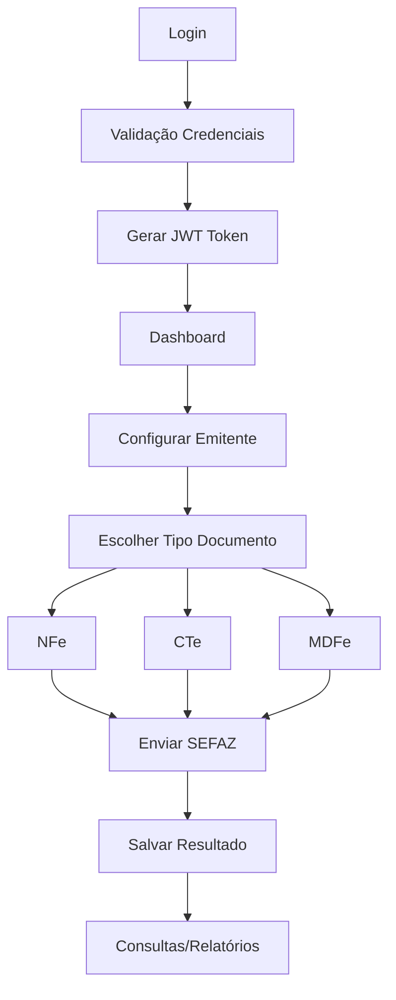

# PRD - Reestruturação Completa do Backend NFe

## 1. Product Overview

Sistema de emissão de NFe, CTe e MDFe com arquitetura limpa, autenticação robusta e integração estável com SEFAZ. O objetivo é eliminar definitivamente os problemas de logout automático, erros 401 e criar uma base sólida para expansão futura.

- **Problema Principal**: Sistema atual possui múltiplas configurações conflitantes, middlewares inconsistentes e estrutura confusa que causa erros de autenticação
- **Usuários**: Contadores e empresas que precisam emitir documentos fiscais eletrônicos
- **Valor**: Sistema funcional que permita emissão confiável de NFe/CTe/MDFe sem interrupções

## 2. Core Features

### 2.1 User Roles

| Role           | Registration Method    | Core Permissions                                      |
| -------------- | ---------------------- | ----------------------------------------------------- |
| Usuário Padrão | Email + senha          | Emitir NFe, consultar documentos, configurar emitente |
| Administrador  | Criado via seed script | Todas as permissões + gerenciar usuários              |

### 2.2 Feature Module

Nosso sistema reestruturado consistirá nas seguintes páginas principais:

1. **Autenticação**: login, registro, validação de token
2. **Dashboard**: visão geral do sistema, status SEFAZ, certificados
3. **Configuração do Emitente**: dados da empresa, endereço, regime tributário
4. **Emissão de NFe**: formulário de emissão, validação, envio SEFAZ
5. **Emissão de CTe**: formulário específico para conhecimento de transporte
6. **Emissão de MDFe**: formulário para manifesto de documentos fiscais
7. **Consultas**: busca de documentos emitidos, status, cancelamentos
8. **Relatórios**: histórico de emissões, logs de sistema

### 2.3 Page Details

| Page Name    | Module Name      | Feature description                                                  |
| ------------ | ---------------- | -------------------------------------------------------------------- |
| Autenticação | Login/Registro   | Autenticar usuário com JWT, registrar novos usuários, validar tokens |
| Dashboard    | Status Sistema   | Exibir status SEFAZ, certificados, estatísticas de emissão           |
| Configuração | Dados Emitente   | Configurar dados da empresa, endereço, certificado digital           |
| Emissão NFe  | Formulário NFe   | Criar NFe com produtos/serviços, calcular impostos, enviar SEFAZ     |
| Emissão CTe  | Formulário CTe   | Criar conhecimento de transporte, dados remetente/destinatário       |
| Emissão MDFe | Formulário MDFe  | Criar manifesto de documentos fiscais eletrônicos                    |
| Consultas    | Busca Documentos | Consultar NFe/CTe/MDFe por chave, período, status                    |
| Relatórios   | Logs Sistema     | Visualizar histórico de operações, erros, auditoria                  |

## 3. Core Process

**Fluxo Principal do Usuário:**

1. Usuário faz login no sistema
2. Sistema valida credenciais e retorna JWT token
3. Usuário configura dados do emitente (se primeira vez)
4. Usuário acessa formulário de emissão (NFe/CTe/MDFe)
5. Sistema valida dados e envia para SEFAZ
6. Sistema retorna resultado e salva documento
7. Usuário pode consultar documentos emitidos

**Fluxo de Autenticação:**

1. Login → Validação → Token JWT → Acesso às rotas protegidas
2. Middleware verifica token em cada requisição
3. Token expirado → Renovação automática ou logout



## 4. User Interface Design

### 4.1 Design Style

- **Cores Primárias**: #2563eb (azul), #059669 (verde), #dc2626 (vermelho)
- **Cores Secundárias**: #64748b (cinza), #f8fafc (fundo claro)
- **Botões**: Estilo moderno com bordas arredondadas (8px), sombras sutis
- **Fonte**: Inter ou system fonts, tamanhos 14px (corpo), 16px (títulos), 12px (labels)
- **Layout**: Design limpo com cards, navegação lateral, breadcrumbs
- **Ícones**: Lucide React ou Heroicons para consistência

### 4.2 Page Design Overview

| Page Name    | Module Name         | UI Elements                                                      |
| ------------ | ------------------- | ---------------------------------------------------------------- |
| Autenticação | Login Form          | Card centralizado, campos email/senha, botão azul, link registro |
| Dashboard    | Status Cards        | Grid de cards com métricas, gráficos simples, cores de status    |
| Configuração | Formulário Empresa  | Formulário em etapas, validação em tempo real, preview dados     |
| Emissão NFe  | Formulário Produtos | Tabela de produtos, cálculos automáticos, botões ação            |
| Consultas    | Lista Documentos    | Tabela paginada, filtros, badges de status, ações rápidas        |

### 4.3 Responsiveness

Sistema desktop-first com adaptação mobile. Interface otimizada para tablets e smartphones com navegação touch-friendly.

## 5. Problemas Identificados na Análise

### 5.1 Problemas Críticos de Arquitetura

**Múltiplos Pontos de Entrada:**

- `app.js`, `app-real.js`, `app-simples.js` - Confusão sobre qual usar
- Configurações conflitantes entre arquivos
- Middlewares duplicados e inconsistentes

**Sistema de Autenticação Fragmentado:**

- `auth.js`, `auth-real.js`, `auth-simples.js` - Múltiplas implementações
- Middleware condicional baseado em `SIMULATION_MODE` causa inconsistências
- Token JWT não sendo validado corretamente em produção

**Configurações de Ambiente Caóticas:**

- Múltiplos arquivos `.env.*` sem padrão claro
- Variáveis conflitantes entre desenvolvimento/produção
- Scripts de deploy inconsistentes

### 5.2 Problemas de Banco de Dados

**Dupla Implementação:**

- MongoDB (database.js) vs Arquivo JSON (database-simples.js)
- Modelos Mongoose não utilizados consistentemente
- Dados podem ficar dessincronizados

**Estrutura de Dados Inconsistente:**

- Campos obrigatórios não validados
- Relacionamentos não definidos claramente
- Falta de índices para performance

### 5.3 Problemas de Integração SEFAZ

**Cliente SEFAZ Instável:**

- Timeout não configurado adequadamente
- Certificados não validados corretamente
- Respostas SOAP não tratadas adequadamente

**Modo Simulação Problemático:**

- Lógica condicional espalhada pelo código
- Dificulta testes e validação
- Pode causar comportamentos inesperados

## 6. Arquitetura Proposta - Limpa e Funcional

### 6.1 Estrutura de Arquivos Simplificada

```
backend/
├── src/
│   ├── controllers/          # Controladores das rotas
│   ├── middleware/           # Apenas auth.js (unificado)
│   ├── models/              # Modelos Mongoose limpos
│   ├── services/            # Serviços de negócio
│   ├── routes/              # Definição de rotas
│   ├── utils/               # Utilitários
│   └── config/              # Configurações centralizadas
├── app.js                   # ÚNICO ponto de entrada
├── package.json
├── .env                     # ÚNICA configuração de ambiente
└── ecosystem.config.js      # PM2 simplificado
```

### 6.2 Middleware de Autenticação Unificado

**Características:**

- JWT com refresh token
- Validação consistente em todas as rotas
- Logs estruturados de acesso
- Rate limiting para segurança

### 6.3 Banco de Dados Único

**MongoDB como padrão:**

- Modelos Mongoose bem definidos
- Validações no schema
- Índices para performance
- Migrations para atualizações

### 6.4 Integração SEFAZ Robusta

**Cliente SEFAZ unificado:**

- Pool de conexões
- Retry automático
- Timeout configurável
- Logs detalhados de operações

## 7. Arquivos para Deletar

### 7.1 Arquivos Duplicados/Obsoletos

```
backend/
├── app-real.js              # DELETAR - usar apenas app.js
├── app-simples.js           # DELETAR - usar apenas app.js
├── middleware/
│   ├── auth.js              # DELETAR - manter apenas auth-real.js renomeado
│   └── auth-simples.js      # DELETAR - manter apenas auth-real.js renomeado
├── config/
│   └── database-simples.js  # DELETAR - usar apenas database.js
├── .env.*                   # DELETAR todos exceto .env
├── debug-*.js               # DELETAR - scripts de debug temporários
├── check-*.js               # DELETAR - scripts de verificação temporários
├── monitor-*.js             # DELETAR - scripts de monitoramento temporários
└── nfe-send.js              # DELETAR - funcionalidade duplicada
```

### 7.2 Scripts Desnecessários

```
scripts/
├── set-*.ps1                # DELETAR - usar apenas variáveis de ambiente
├── clean-and-seed.ps1       # SIMPLIFICAR - manter apenas seed básico
└── validar-producao.js      # SIMPLIFICAR - integrar ao health check
```

### 7.3 Arquivos de Teste/Debug

```
├── reports/                 # DELETAR - relatórios temporários
├── logs/                    # MANTER estrutura, limpar conteúdo
├── xmls/                    # MANTER estrutura, limpar XMLs de teste
└── data/                    # DELETAR - dados de desenvolvimento
```

## 8. Roadmap de Implementação

### 8.1 Fase 1 - Limpeza e Estruturação (1-2 dias)

1. **Backup do sistema atual**
2. **Deletar arquivos desnecessários**
3. **Criar estrutura limpa de pastas**
4. **Unificar ponto de entrada (app.js)**
5. **Consolidar middleware de autenticação**

### 8.2 Fase 2 - Banco de Dados e Modelos (1 dia)

1. **Definir modelos Mongoose finais**
2. **Criar migrations se necessário**
3. **Implementar validações de schema**
4. **Configurar índices de performance**

### 8.3 Fase 3 - Autenticação Robusta (1 dia)

1. **Implementar JWT com refresh token**
2. **Criar middleware unificado**
3. **Implementar rate limiting**
4. **Configurar logs de segurança**

### 8.4 Fase 4 - Integração SEFAZ (1-2 dias)

1. **Refatorar cliente SEFAZ**
2. **Implementar pool de conexões**
3. **Configurar retry e timeout**
4. **Testar com certificados reais**

### 8.5 Fase 5 - APIs CTe e MDFe (2-3 dias)

1. **Implementar formulários CTe**
2. **Implementar formulários MDFe**
3. **Integrar com SEFAZ específicos**
4. **Criar validações específicas**

### 8.6 Fase 6 - Testes e Deploy (1 dia)

1. **Testes de integração**
2. **Validação em homologação**
3. **Deploy em produção**
4. **Monitoramento pós-deploy**

## 9. Configurações de Ambiente Simplificadas

### 9.1 Variáveis Essenciais

```env
# Aplicação
NODE_ENV=production
PORT=3001
JWT_SECRET=sua_chave_secreta_forte

# Banco de Dados
MONGODB_URI=mongodb://localhost:27017/brandaocontador_nfe

# SEFAZ
AMBIENTE=1
UF=MS
CNPJ_EMITENTE=seu_cnpj
CERT_PATH=./certificados/certificado.pfx
CERT_PASS=senha_certificado

# Recursos
SIMULATION_MODE=false
SAVE_XML_FILES=true
XML_OUTPUT_DIR=./xmls
TIMEOUT=30000
```

### 9.2 Configuração PM2 Simplificada

```javascript
module.exports = {
  apps: [
    {
      name: "brandaocontador-nfe",
      script: "./app.js",
      instances: 1,
      autorestart: true,
      watch: false,
      max_memory_restart: "1G",
      env_file: ".env",
    },
  ],
};
```

## 10. Métricas de Sucesso

### 10.1 Indicadores Técnicos

- **Zero erros 401** em operações normais
- **Zero logout automático** não solicitado
- **Tempo de resposta < 2s** para emissão NFe
- **99% uptime** do sistema
- **Logs estruturados** para debugging

### 10.2 Indicadores de Negócio

- **Emissão NFe funcional** em 100% dos casos válidos
- **Integração SEFAZ estável** sem timeouts
- **Suporte CTe e MDFe** implementado
- **Interface responsiva** em todos os dispositivos
- **Deploy automatizado** sem intervenção manual

## 11. Considerações de Segurança

### 11.1 Autenticação e Autorização

- JWT com expiração adequada (1h) e refresh token (7 dias)
- Rate limiting por IP e usuário
- Validação de entrada em todas as rotas
- Logs de auditoria para ações críticas

### 11.2 Proteção de Dados

- Certificados digitais protegidos
- Senhas hasheadas com bcrypt
- Comunicação HTTPS obrigatória
- Backup automático de dados críticos

### 11.3 Integração SEFAZ

- Certificados A1 validados
- Timeout adequado para evitar travamentos
- Retry automático em falhas temporárias
- Logs detalhados para auditoria fiscal

---

**Conclusão**: Esta reestruturação eliminará definitivamente os problemas de logout automático e erros 401, criando uma base sólida para o sistema de emissão fiscal. O foco é simplicidade, robustez e funcionalidade, removendo toda a complexidade desnecessária que causa os problemas atuais.
