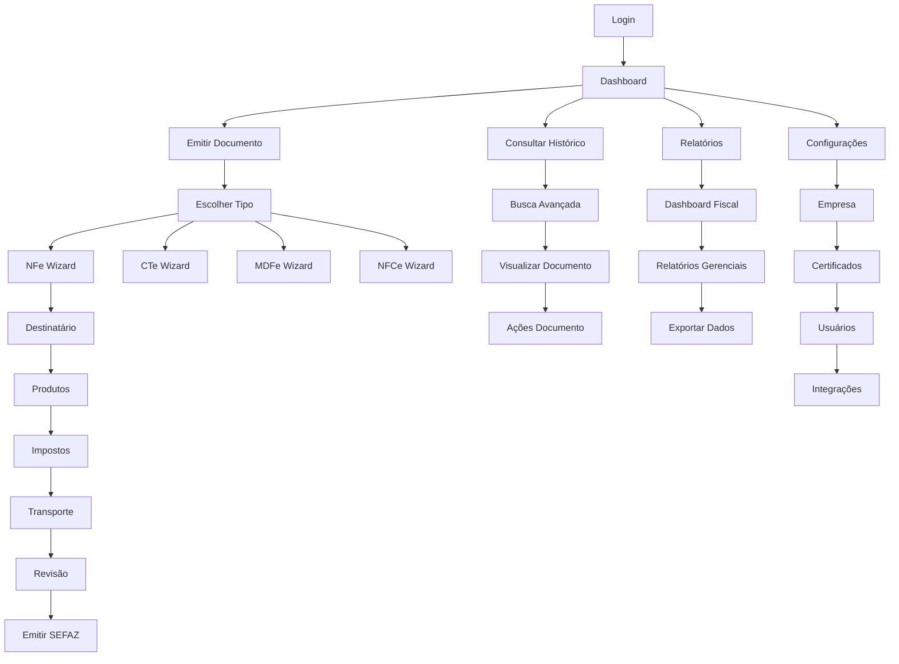

# PRD - FRONTEND NFE MODERNIZADO

## 1. Product Overview

Sistema frontend moderno e profissional para emissão de documentos fiscais eletrônicos (NFe, CTe, MDFe, NFCe) com foco em experiência do usuário, confiabilidade e conformidade fiscal.

O produto resolve a necessidade de contadores e empresas terem uma interface intuitiva, segura e eficiente para gerenciar todos os aspectos da documentação fiscal eletrônica, desde a emissão até o acompanhamento e relatórios.

Posiciona-se como referência em software fiscal no Brasil, oferecendo tecnologia de ponta com interface moderna que transmite confiança e profissionalismo aos clientes.

## 2. Core Features

### 2.1 User Roles

| Role | Registration Method | Core Permissions |
|------|---------------------|------------------|
| Administrador | Criação manual pelo sistema | Acesso total: configurações, usuários, relatórios, emissão de documentos |
| Contador | Convite por administrador | Emissão de documentos, relatórios, consultas, configurações básicas |
| Operador | Convite por administrador ou contador | Emissão de documentos, consultas básicas, histórico |
| Visualizador | Convite por administrador | Apenas consulta de documentos e relatórios básicos |

### 2.2 Feature Module

O sistema frontend modernizado consiste nas seguintes páginas principais:

1. **Dashboard Executivo**: métricas em tempo real, indicadores fiscais, status do sistema, alertas importantes
2. **Emissão de Documentos**: wizards inteligentes para NFe, CTe, MDFe e NFCe com validação em tempo real
3. **Consulta e Histórico**: busca avançada, filtros inteligentes, visualização de documentos, status SEFAZ
4. **Relatórios Avançados**: dashboards interativos, análises fiscais, exportação de dados, gráficos executivos
5. **Gestão de Clientes**: cadastro completo, validação automática, histórico de documentos por cliente
6. **Catálogo de Produtos**: gestão de produtos/serviços, cálculos tributários automáticos, NCM e CEST
7. **Configurações**: perfil da empresa, certificados digitais, usuários, integrações, preferências
8. **Status do Sistema**: monitoramento SEFAZ, conectividade, certificados, logs de sistema

### 2.3 Page Details

| Page Name | Module Name | Feature description |
|-----------|-------------|---------------------|
| Dashboard Executivo | Métricas Principais | Exibir NFes emitidas hoje, faturamento mensal, documentos pendentes, taxa de sucesso com gráficos em tempo real |
| Dashboard Executivo | Gráficos Interativos | Mostrar emissões por período, documentos por tipo, evolução de faturamento, análise de impostos |
| Dashboard Executivo | Alertas e Notificações | Exibir certificados próximos ao vencimento, documentos rejeitados, problemas de conectividade SEFAZ |
| Emissão NFe | Wizard Destinatário | Buscar e validar CNPJ/CPF, auto-completar dados via Receita Federal, validar inscrição estadual |
| Emissão NFe | Wizard Produtos | Adicionar itens com busca inteligente, calcular impostos automaticamente, validar NCM e CEST |
| Emissão NFe | Wizard Impostos | Calcular ICMS, IPI, PIS, COFINS baseado no regime tributário, aplicar substituição tributária |
| Emissão NFe | Wizard Transporte | Configurar dados de entrega, calcular frete, definir volumes e peso |
| Emissão NFe | Revisão e Emissão | Validar dados completos, gerar preview do DANFE, emitir para SEFAZ, acompanhar status |
| Emissão CTe | Wizard Transporte | Configurar modal rodoviário/aéreo/aquaviário, dados de remetente/destinatário, valores de frete |
| Emissão CTe | Wizard Carga | Definir produtos transportados, peso, volumes, documentos fiscais vinculados |
| Emissão MDFe | Wizard Manifesto | Configurar dados do condutor, veículo, percurso, documentos fiscais do manifesto |
| Emissão NFCe | Wizard Consumidor | Emitir nota para consumidor final, integrar com PDV, gerar QR Code para consulta |
| Consulta e Histórico | Busca Avançada | Filtrar por período, tipo de documento, status, cliente, valor, com busca textual inteligente |
| Consulta e Histórico | Visualização de Documentos | Exibir detalhes completos, baixar XML/PDF, consultar status na SEFAZ, histórico de eventos |
| Consulta e Histórico | Ações em Lote | Cancelar múltiplos documentos, reenviar emails, exportar selecionados, inutilizar numeração |
| Relatórios Avançados | Dashboard Fiscal | Gráficos de faturamento, impostos pagos, documentos por status, análise de clientes |
| Relatórios Avançados | Relatórios Gerenciais | Livro de registro de saídas, resumo de impostos, análise de vendas, relatórios customizados |
| Relatórios Avançados | Exportação de Dados | Exportar para Excel/PDF, agendar relatórios automáticos, enviar por email |
| Gestão de Clientes | Cadastro de Clientes | Criar/editar clientes, validar CNPJ/CPF, buscar dados na Receita Federal, histórico fiscal |
| Gestão de Clientes | Consulta de Clientes | Buscar clientes, filtrar por tipo, visualizar histórico de documentos, análise de vendas |
| Catálogo de Produtos | Gestão de Produtos | Cadastrar produtos/serviços, definir NCM/CEST, configurar impostos, controle de estoque |
| Catálogo de Produtos | Cálculos Tributários | Configurar alíquotas por produto, simular impostos, aplicar benefícios fiscais |
| Configurações Empresa | Dados da Empresa | Editar razão social, endereço, inscrições, regime tributário, dados bancários |
| Configurações Empresa | Certificados Digitais | Upload de certificados A1/A3, validar validade, configurar senhas, backup seguro |
| Configurações Sistema | Gestão de Usuários | Criar/editar usuários, definir permissões, controlar acesso, log de atividades |
| Configurações Sistema | Integrações | Configurar APIs externas, webhooks, sincronização com ERPs, backup automático |
| Status do Sistema | Monitoramento SEFAZ | Verificar status dos webservices, latência de conexão, disponibilidade por UF |
| Status do Sistema | Saúde do Sistema | Monitorar performance, uso de recursos, logs de erro, alertas automáticos |

## 3. Core Process

### Fluxo Principal do Usuário

**Fluxo do Contador/Administrador:**
1. Login no sistema com autenticação segura
2. Visualização do dashboard com métricas atualizadas
3. Emissão de documentos fiscais através de wizards inteligentes
4. Acompanhamento do status de processamento na SEFAZ
5. Consulta de documentos emitidos e geração de relatórios
6. Gestão de clientes e produtos conforme necessário
7. Configuração de certificados e parâmetros do sistema

**Fluxo do Operador:**
1. Login no sistema com permissões limitadas
2. Acesso ao dashboard com informações relevantes
3. Emissão de documentos fiscais pré-configurados
4. Consulta de histórico e status de documentos
5. Geração de relatórios básicos

## 4. User Interface Design

### 4.1 Design Style

**Paleta de Cores:**
- Primária: #3b82f6 (Azul confiável e profissional)
- Secundária: #1e40af (Azul escuro para contraste)
- Fiscal NFe: #3b82f6 (Azul NFe)
- Fiscal CTe: #10b981 (Verde CTe)
- Fiscal MDFe: #f59e0b (Amarelo MDFe)
- Fiscal NFCe: #8b5cf6 (Roxo NFCe)
- Sucesso: #10b981 (Verde)
- Erro: #ef4444 (Vermelho)
- Aviso: #f59e0b (Amarelo)
- Neutros: #f8fafc, #e2e8f0, #64748b, #1e293b

**Tipografia:**
- Fonte principal: Inter (moderna e legível)
- Fonte monospace: JetBrains Mono (para códigos e números)
- Tamanhos: 12px (small), 14px (base), 16px (medium), 18px (large), 24px (heading)

**Estilo de Botões:**
- Primários: Cantos arredondados (8px), sombra sutil, hover com elevação
- Secundários: Borda sólida, fundo transparente, hover com fundo
- Fiscais: Cores específicas por tipo de documento, ícones identificadores

**Layout:**
- Design responsivo mobile-first
- Sidebar colapsável com navegação principal
- Cards com sombras sutis e bordas arredondadas
- Espaçamento consistente baseado em grid 8px
- Animações suaves (200-300ms) para transições

**Iconografia:**
- Lucide React para ícones gerais (consistentes e modernos)
- Ícones específicos para documentos fiscais
- Tamanhos: 16px (small), 20px (medium), 24px (large)
- Estilo outline para melhor legibilidade

### 4.2 Page Design Overview

| Page Name | Module Name | UI Elements |
|-----------|-------------|-------------|
| Dashboard Executivo | Métricas Cards | Cards com gradientes sutis, ícones coloridos, números grandes (24px), indicadores de crescimento com setas |
| Dashboard Executivo | Gráficos | Gráficos Recharts com cores da paleta fiscal, tooltips interativos, legendas claras, responsivos |
| Dashboard Executivo | Alertas | Banners coloridos por prioridade, ícones de status, botões de ação, animação de entrada |
| Emissão NFe | Wizard Progress | Barra de progresso horizontal, steps clicáveis, indicadores visuais de completude |
| Emissão NFe | Formulários | Inputs com labels flutuantes, validação em tempo real, auto-complete estilizado, máscaras de entrada |
| Emissão NFe | Botões de Ação | Botão primário "Próximo" azul NFe, secundário "Anterior" outline, "Salvar Rascunho" ghost |
| Consulta e Histórico | Tabela de Dados | DataTable responsiva, filtros no header, paginação, ações por linha, status coloridos |
| Consulta e Histórico | Filtros Avançados | Sidebar de filtros colapsável, date pickers, selects múltiplos, busca textual com ícone |
| Relatórios Avançados | Dashboard Cards | Cards com gráficos integrados, métricas destacadas, cores por categoria, hover effects |
| Relatórios Avançados | Controles | Seletores de período, filtros dropdown, botões de exportação com ícones, loading states |
| Configurações | Formulários | Seções organizadas em tabs, inputs agrupados, validação visual, botões de salvar destacados |
| Configurações | Upload de Arquivos | Drag & drop area estilizada, preview de certificados, indicadores de validade, progress bars |

### 4.3 Responsiveness

**Estratégia Mobile-First:**
- Breakpoints: 640px (sm), 768px (md), 1024px (lg), 1280px (xl)
- Sidebar colapsável em menu hambúrguer em telas < 768px
- Cards empilhados verticalmente em mobile
- Tabelas com scroll horizontal e ações simplificadas
- Formulários com inputs full-width em mobile
- Botões com tamanho touch-friendly (44px mínimo)

**Otimizações Touch:**
- Gestos de swipe para navegação entre steps do wizard
- Pull-to-refresh no dashboard e listas
- Tap targets adequados para dedos
- Feedback visual imediato em toques
- Zoom desabilitado em inputs para evitar comportamento indesejado

**Adaptações por Dispositivo:**
- Desktop: Sidebar fixa, múltiplas colunas, hover states
- Tablet: Sidebar colapsável, layout híbrido, gestos touch
- Mobile: Navegação bottom tab, layout single-column, gestos nativos

---

**🎯 RESULTADO**: Uma interface **moderna, intuitiva e profissional** que estabelece novo padrão de qualidade para sistemas fiscais, transmitindo confiança e eficiência aos usuários.