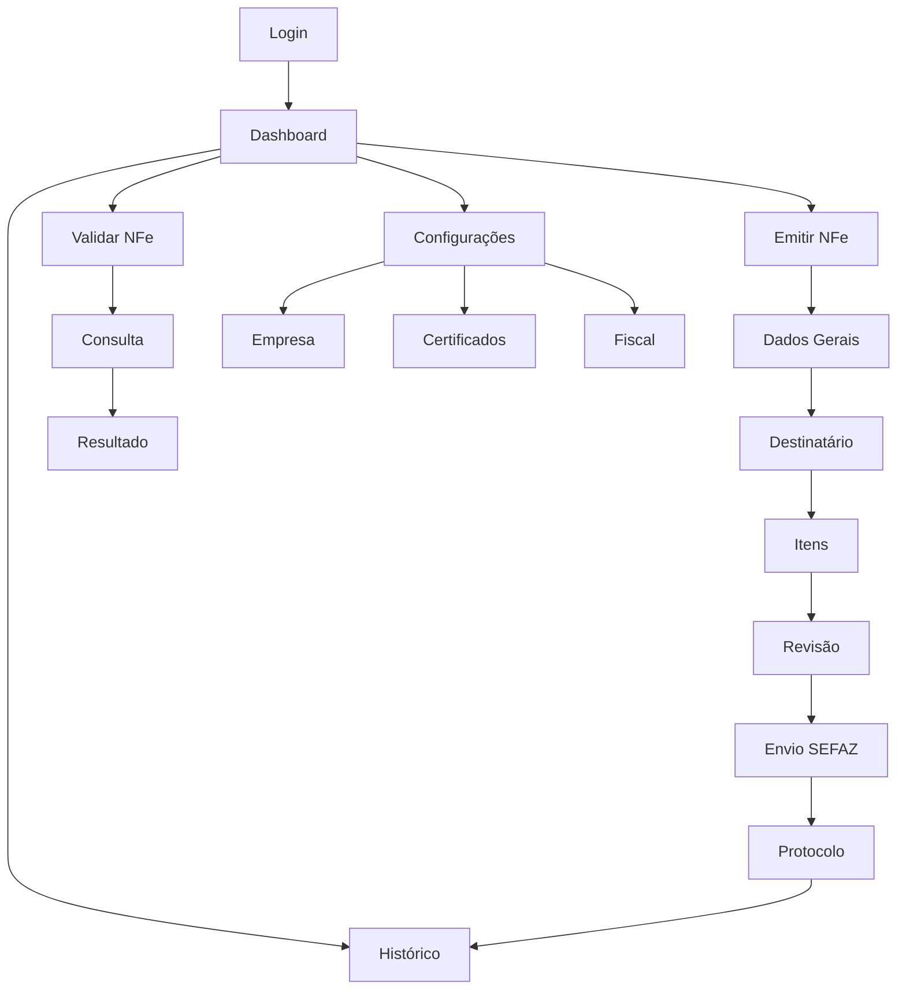

# Documento de Requisitos do Produto - Sistema NFe Brandão Contador

## 1. Product Overview

O Sistema NFe Brandão Contador é uma plataforma completa para emissão, validação e gestão de Notas Fiscais Eletrônicas, desenvolvida para contadores e empresas que precisam de uma solução robusta e automatizada para suas obrigações fiscais.

O sistema resolve os problemas de complexidade na emissão de NFe, dificuldades de integração com a SEFAZ, e falta de controle centralizado sobre as notas fiscais emitidas, oferecendo uma interface intuitiva e processos automatizados.

O objetivo é se tornar a principal ferramenta de gestão fiscal para pequenas e médias empresas, com potencial de mercado estimado em R$ 50 milhões no segmento de contabilidade digital.

## 2. Core Features

### 2.1 User Roles

| Role          | Registration Method         | Core Permissions                                                                                 |
| ------------- | --------------------------- | ------------------------------------------------------------------------------------------------ |
| Usuário Final | Email + senha ou convite    | Pode emitir NFe, consultar histórico, validar documentos                                         |
| Contador      | Registro profissional + CRC | Pode gerenciar múltiplos clientes, emitir NFe em nome de terceiros, acessar relatórios avançados |
| Administrador | Acesso interno do sistema   | Pode gerenciar usuários, configurar sistema, acessar logs e métricas                             |

### 2.2 Feature Module

Nosso sistema NFe consiste nas seguintes páginas principais:

1. **Dashboard**: painel de controle, estatísticas de NFe, status do sistema, atalhos rápidos
2. **Emissão de NFe**: formulário de emissão, dados do emitente/destinatário, itens da nota, cálculos automáticos
3. **Validação de NFe**: consulta de NFe, validação de autenticidade, verificação de status na SEFAZ
4. **Histórico de NFe**: listagem de notas emitidas, filtros avançados, exportação de relatórios
5. **Configurações**: dados da empresa, certificados digitais, configurações de impostos
6. **Painel Administrativo**: gestão de usuários, monitoramento do sistema, configurações globais
7. **Login/Registro**: autenticação de usuários, recuperação de senha, criação de contas

### 2.3 Page Details

| Page Name        | Module Name                  | Feature description                                                                |
| ---------------- | ---------------------------- | ---------------------------------------------------------------------------------- |
| Dashboard        | Painel de Estatísticas       | Exibir total de NFe emitidas, validadas, valor total faturado, status dos serviços |
| Dashboard        | Atalhos Rápidos              | Botões para emissão rápida, validação, acesso ao histórico                         |
| Dashboard        | Notificações                 | Alertas sobre certificados vencendo, problemas na SEFAZ, atualizações do sistema   |
| Emissão de NFe   | Dados Gerais                 | Inserir número, série, tipo de operação, data de emissão, natureza da operação     |
| Emissão de NFe   | Dados do Emitente            | Carregar automaticamente CNPJ, razão social, endereço da empresa configurada       |
| Emissão de NFe   | Dados do Destinatário        | Inserir CPF/CNPJ, nome/razão social, endereço completo com validação               |
| Emissão de NFe   | Itens da Nota                | Adicionar/remover produtos, calcular impostos automaticamente, validar NCM         |
| Emissão de NFe   | Cálculos e Totais            | Calcular automaticamente ICMS, IPI, PIS, COFINS, valor total da nota               |
| Emissão de NFe   | Envio para SEFAZ             | Assinar digitalmente, enviar para SEFAZ, receber protocolo de autorização          |
| Validação de NFe | Consulta por Chave           | Inserir chave de acesso, consultar status na SEFAZ, exibir dados da nota           |
| Validação de NFe | Upload de XML                | Fazer upload de arquivo XML, validar estrutura, extrair informações                |
| Validação de NFe | Verificação de Autenticidade | Validar assinatura digital, verificar integridade dos dados                        |
| Histórico de NFe | Listagem de Notas            | Exibir todas as NFe emitidas com paginação, ordenação por data/valor               |
| Histórico de NFe | Filtros Avançados            | Filtrar por período, cliente, status, tipo de operação, valor                      |
| Histórico de NFe | Exportação                   | Gerar relatórios em PDF/Excel, exportar XMLs em lote                               |
| Configurações    | Dados da Empresa             | Configurar CNPJ, razão social, endereço, regime tributário                         |
| Configurações    | Certificados Digitais        | Upload de certificado A1/A3, configurar senha, verificar validade                  |
| Configurações    | Configurações Fiscais        | Definir alíquotas padrão, configurar CST/CSOSN, regras de tributação               |
| Painel Admin     | Gestão de Usuários           | Listar usuários, alterar permissões, desativar contas, logs de acesso              |
| Painel Admin     | Monitoramento                | Métricas de uso, performance do sistema, logs de erro, status dos serviços         |
| Painel Admin     | Configurações Globais        | Configurar integrações, definir limites de uso, configurar notificações            |
| Login/Registro   | Autenticação                 | Login com email/senha, autenticação de dois fatores, integração social             |
| Login/Registro   | Recuperação de Senha         | Envio de email para reset, validação de token, definição de nova senha             |
| Login/Registro   | Criação de Conta             | Registro com validação de email, termos de uso, configuração inicial               |

## 3. Core Process

### Fluxo do Usuário Final

1. Usuário faz login no sistema
2. Acessa o dashboard para visualizar estatísticas
3. Clica em "Emitir NFe" para criar nova nota fiscal
4. Preenche dados do destinatário e itens
5. Sistema calcula impostos automaticamente
6. Usuário revisa e confirma a emissão
7. Sistema assina digitalmente e envia para SEFAZ
8. Recebe protocolo de autorização
9. NFe fica disponível no histórico

### Fluxo do Contador

1. Contador faz login com credenciais profissionais
2. Seleciona cliente para emitir NFe
3. Segue mesmo fluxo de emissão
4. Pode acessar relatórios consolidados de todos os clientes
5. Gerencia certificados digitais dos clientes

### Fluxo do Administrador

1. Admin acessa painel administrativo
2. Monitora uso do sistema e performance
3. Gerencia usuários e permissões
4. Configura integrações e limites
5. Analisa logs e métricas de uso

## 4. User Interface Design

### 4.1 Design Style

- **Cores Primárias**: Azul corporativo (#1e40af), Verde sucesso (#16a34a), Vermelho erro (#dc2626)
- **Cores Secundárias**: Cinza neutro (#6b7280), Branco (#ffffff), Azul claro (#dbeafe)
- **Estilo de Botões**: Arredondados (border-radius: 8px), com sombra sutil, efeito hover
- **Tipografia**: Inter como fonte principal, tamanhos 14px (corpo), 16px (títulos), 12px (labels)
- **Layout**: Design baseado em cards, navegação superior fixa, sidebar retrátil
- **Ícones**: Lucide React icons, estilo outline, tamanho 20px padrão

### 4.2 Page Design Overview

| Page Name        | Module Name            | UI Elements                                                                          |
| ---------------- | ---------------------- | ------------------------------------------------------------------------------------ |
| Dashboard        | Painel de Estatísticas | Cards com números grandes, gráficos de linha/barra, cores de status (verde/vermelho) |
| Dashboard        | Atalhos Rápidos        | Botões grandes com ícones, layout em grid 2x2, cores primárias                       |
| Emissão de NFe   | Formulário             | Layout em steps/wizard, campos organizados em seções, validação em tempo real        |
| Emissão de NFe   | Itens da Nota          | Tabela responsiva, botões de ação inline, cálculos automáticos destacados            |
| Validação de NFe | Consulta               | Campo de busca centralizado, botão de ação proeminente, resultados em cards          |
| Histórico de NFe | Listagem               | Tabela com paginação, filtros em sidebar, botões de exportação no header             |
| Configurações    | Formulários            | Tabs para organizar seções, campos agrupados logicamente, botões de salvar fixos     |
| Painel Admin     | Dashboard              | Métricas em tempo real, gráficos interativos, tabelas de dados com ações             |
| Login/Registro   | Autenticação           | Formulário centralizado, logo da empresa, links secundários, design minimalista      |

### 4.3 Responsiveness

O sistema é desenvolvido com abordagem mobile-first, garantindo funcionamento completo em dispositivos móveis. Inclui otimizações para touch, menus adaptáveis e layouts flexíveis que se ajustam a diferentes tamanhos de tela (320px a 1920px+).

