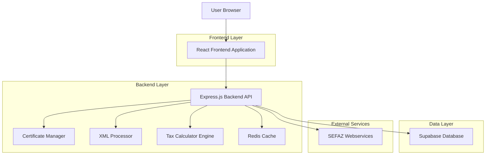
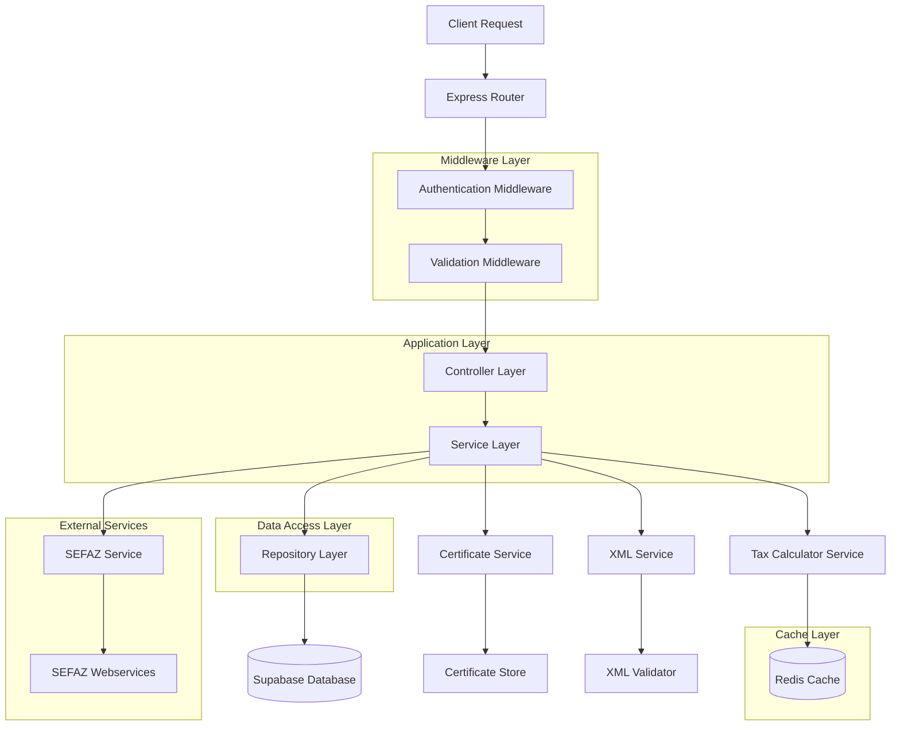
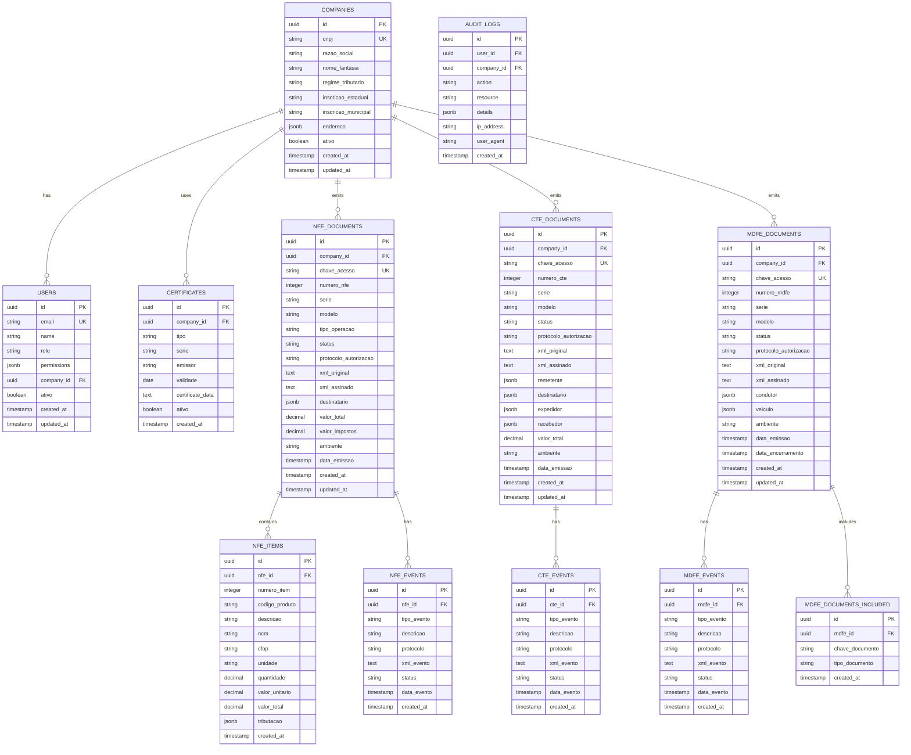

# Arquitetura Técnica - Sistema NFe/CTe/MDFe 2025/2026

## 1. Architecture Design



## 2. Technology Description

- **Frontend**: React@18 + TypeScript@5 + Tailwind CSS@3 + Vite@5 + React Router@6 + React Hook Form@7 + Zustand@4
- **Backend**: Node.js@20 + Express@4 + TypeScript@5 + Helmet@7 + CORS@2 + Rate Limiting
- **Database**: Supabase (PostgreSQL) + Row Level Security
- **Cache**: Redis@7 (session, tax calculations, SEFAZ responses)
- **Security**: Certificado Digital A1/A3, TLS 1.2+, JWT tokens, HTTPS only
- **XML Processing**: xml2js@0.6 + xmlbuilder2@3 + node-forge@1 (digital signature)
- **PDF Generation**: Puppeteer@21 (DANFE generation)
- **Monitoring**: Winston@3 (logging) + Morgan@1 (HTTP logs)

## 3. Route Definitions

| Route | Purpose |
|-------|---------|
| / | Dashboard principal com status SEFAZ e resumo fiscal |
| /login | Autenticação com certificado digital |
| /dashboard | Visão geral de documentos e alertas |
| /nfe/emitir | Formulário de emissão de NFe com cálculos automáticos |
| /nfe/consultar | Consulta de NFe por chave ou CNPJ |
| /cte/emitir | Formulário de emissão de CTe |
| /mdfe/emitir | Formulário de emissão de MDFe |
| /eventos | Gestão de cancelamentos, correções e devoluções |
| /eventos/cancelar/:id | Cancelamento de documento específico |
| /eventos/corrigir/:id | Carta de correção eletrônica |
| /eventos/devolver/:id | Processo de devolução/estorno |
| /relatorios | Relatórios fiscais e apuração de impostos |
| /relatorios/livros | Livros fiscais eletrônicos |
| /configuracoes | Configurações de empresa e certificados |
| /configuracoes/certificado | Gestão de certificados digitais |
| /configuracoes/empresa | Dados da empresa e regime tributário |
| /auditoria | Logs de sistema e rastreabilidade |
| /usuarios | Gerenciamento de usuários (admin only) |

## 4. API Definitions

### 4.1 Core API

#### Autenticação
```
POST /api/auth/login
```

Request:
| Param Name | Param Type | isRequired | Description |
|------------|------------|------------|-------------|
| certificate | File | true | Certificado digital A1 (.pfx) ou token A3 |
| password | string | true | Senha do certificado |
| cnpj | string | true | CNPJ da empresa |

Response:
| Param Name | Param Type | Description |
|------------|------------|-------------|
| token | string | JWT token para autenticação |
| user | UserData | Dados do usuário autenticado |
| company | CompanyData | Dados da empresa |
| certificate | CertificateInfo | Informações do certificado |

#### Emissão NFe
```
POST /api/nfe/emitir
```

Request:
| Param Name | Param Type | isRequired | Description |
|------------|------------|------------|-------------|
| destinatario | Destinatario | true | Dados do destinatário |
| produtos | Produto[] | true | Lista de produtos/serviços |
| transporte | Transporte | false | Dados de transporte |
| pagamento | Pagamento | true | Formas de pagamento |
| observacoes | string | false | Observações adicionais |
| ambiente | 'homolog' \| 'producao' | true | Ambiente SEFAZ |

Response:
| Param Name | Param Type | Description |
|------------|------------|-------------|
| chaveAcesso | string | Chave de acesso da NFe |
| numeroNFe | number | Número da NFe |
| protocolo | string | Protocolo de autorização SEFAZ |
| xmlAssinado | string | XML assinado da NFe |
| status | 'autorizada' \| 'rejeitada' \| 'pendente' | Status da NFe |

#### Consulta Status SEFAZ
```
GET /api/sefaz/status/:uf
```

Response:
| Param Name | Param Type | Description |
|------------|------------|-------------|
| status | 'online' \| 'offline' | Status do webservice |
| tempoResposta | number | Tempo de resposta em ms |
| ultimaVerificacao | string | Timestamp da última verificação |

#### Cálculo de Impostos
```
POST /api/impostos/calcular
```

Request:
| Param Name | Param Type | isRequired | Description |
|------------|------------|------------|-------------|
| regimeTributario | 'simples' \| 'presumido' \| 'real' | true | Regime da empresa |
| produtos | ProdutoCalculo[] | true | Produtos para cálculo |
| uf | string | true | UF da operação |
| operacao | 'venda' \| 'compra' \| 'transferencia' | true | Tipo de operação |

Response:
| Param Name | Param Type | Description |
|------------|------------|-------------|
| icms | ImpostoDetalhado | Cálculo detalhado do ICMS |
| ipi | ImpostoDetalhado | Cálculo detalhado do IPI |
| pis | ImpostoDetalhado | Cálculo detalhado do PIS |
| cofins | ImpostoDetalhado | Cálculo detalhado do COFINS |
| ibs | ImpostoDetalhado | Cálculo IBS (2026) |
| cbs | ImpostoDetalhado | Cálculo CBS (2026) |
| observacoes | string | Texto para campo observações |

### 4.2 Types Definition

```typescript
interface UserData {
  id: string;
  name: string;
  email: string;
  role: 'admin' | 'contador' | 'operador' | 'cliente';
  permissions: string[];
  companies: string[];
}

interface CompanyData {
  cnpj: string;
  razaoSocial: string;
  nomeFantasia: string;
  regimeTributario: 'simples' | 'presumido' | 'real';
  inscricaoEstadual: string;
  inscricaoMunicipal?: string;
  endereco: Endereco;
  certificado: CertificateInfo;
}

interface CertificateInfo {
  tipo: 'A1' | 'A3';
  validade: string;
  emissor: string;
  serie: string;
  diasParaVencer: number;
}

interface Produto {
  codigo: string;
  descricao: string;
  ncm: string;
  cfop: string;
  unidade: string;
  quantidade: number;
  valorUnitario: number;
  valorTotal: number;
  gtin?: string;
  tributacao: TributacaoProduto;
}

interface TributacaoProduto {
  icms: {
    cst: string;
    aliquota: number;
    base: number;
    valor: number;
  };
  ipi: {
    cst: string;
    aliquota: number;
    base: number;
    valor: number;
  };
  pis: {
    cst: string;
    aliquota: number;
    base: number;
    valor: number;
  };
  cofins: {
    cst: string;
    aliquota: number;
    base: number;
    valor: number;
  };
  // Campos 2026
  ibs?: {
    aliquota: number;
    base: number;
    valor: number;
  };
  cbs?: {
    aliquota: number;
    base: number;
    valor: number;
  };
  is?: {
    aliquota: number;
    base: number;
    valor: number;
  };
}

interface ImpostoDetalhado {
  base: number;
  aliquota: number;
  valor: number;
  cst?: string;
  baseLegal: string;
  observacoes?: string;
}
```

## 5. Server Architecture Diagram



## 6. Data Model

### 6.1 Data Model Definition



### 6.2 Data Definition Language

#### Companies Table
```sql
-- Create companies table
CREATE TABLE companies (
    id UUID PRIMARY KEY DEFAULT gen_random_uuid(),
    cnpj VARCHAR(14) UNIQUE NOT NULL,
    razao_social VARCHAR(255) NOT NULL,
    nome_fantasia VARCHAR(255),
    regime_tributario VARCHAR(20) NOT NULL CHECK (regime_tributario IN ('simples', 'presumido', 'real')),
    inscricao_estadual VARCHAR(20),
    inscricao_municipal VARCHAR(20),
    endereco JSONB NOT NULL,
    ativo BOOLEAN DEFAULT true,
    created_at TIMESTAMP WITH TIME ZONE DEFAULT NOW(),
    updated_at TIMESTAMP WITH TIME ZONE DEFAULT NOW()
);

-- Create indexes
CREATE INDEX idx_companies_cnpj ON companies(cnpj);
CREATE INDEX idx_companies_ativo ON companies(ativo);

-- Row Level Security
ALTER TABLE companies ENABLE ROW LEVEL SECURITY;

-- Policy for authenticated users to see only their company
CREATE POLICY "Users can only see their company" ON companies
    FOR ALL USING (
        id IN (
            SELECT company_id FROM users 
            WHERE id = auth.uid()
        )
    );

-- Grant permissions
GRANT SELECT, INSERT, UPDATE ON companies TO authenticated;
GRANT SELECT ON companies TO anon;
```

#### Users Table
```sql
-- Create users table
CREATE TABLE users (
    id UUID PRIMARY KEY DEFAULT gen_random_uuid(),
    email VARCHAR(255) UNIQUE NOT NULL,
    name VARCHAR(255) NOT NULL,
    role VARCHAR(20) NOT NULL CHECK (role IN ('admin', 'contador', 'operador', 'cliente')),
    permissions JSONB DEFAULT '[]'::jsonb,
    company_id UUID REFERENCES companies(id) ON DELETE CASCADE,
    ativo BOOLEAN DEFAULT true,
    created_at TIMESTAMP WITH TIME ZONE DEFAULT NOW(),
    updated_at TIMESTAMP WITH TIME ZONE DEFAULT NOW()
);

-- Create indexes
CREATE INDEX idx_users_email ON users(email);
CREATE INDEX idx_users_company_id ON users(company_id);
CREATE INDEX idx_users_role ON users(role);

-- Row Level Security
ALTER TABLE users ENABLE ROW LEVEL SECURITY;

-- Policy for users to see only their company users
CREATE POLICY "Users can see company users" ON users
    FOR ALL USING (
        company_id IN (
            SELECT company_id FROM users 
            WHERE id = auth.uid()
        )
    );

-- Grant permissions
GRANT ALL PRIVILEGES ON users TO authenticated;
```

#### NFE Documents Table
```sql
-- Create nfe_documents table
CREATE TABLE nfe_documents (
    id UUID PRIMARY KEY DEFAULT gen_random_uuid(),
    company_id UUID NOT NULL REFERENCES companies(id) ON DELETE CASCADE,
    chave_acesso VARCHAR(44) UNIQUE NOT NULL,
    numero_nfe INTEGER NOT NULL,
    serie VARCHAR(3) NOT NULL,
    modelo VARCHAR(2) DEFAULT '55',
    tipo_operacao VARCHAR(1) NOT NULL CHECK (tipo_operacao IN ('0', '1')),
    status VARCHAR(20) NOT NULL DEFAULT 'pendente',
    protocolo_autorizacao VARCHAR(20),
    xml_original TEXT,
    xml_assinado TEXT,
    destinatario JSONB NOT NULL,
    valor_total DECIMAL(15,2) NOT NULL,
    valor_impostos DECIMAL(15,2) DEFAULT 0,
    ambiente VARCHAR(10) NOT NULL CHECK (ambiente IN ('homolog', 'producao')),
    data_emissao TIMESTAMP WITH TIME ZONE NOT NULL,
    created_at TIMESTAMP WITH TIME ZONE DEFAULT NOW(),
    updated_at TIMESTAMP WITH TIME ZONE DEFAULT NOW()
);

-- Create indexes
CREATE INDEX idx_nfe_documents_company_id ON nfe_documents(company_id);
CREATE INDEX idx_nfe_documents_chave_acesso ON nfe_documents(chave_acesso);
CREATE INDEX idx_nfe_documents_numero_nfe ON nfe_documents(numero_nfe);
CREATE INDEX idx_nfe_documents_status ON nfe_documents(status);
CREATE INDEX idx_nfe_documents_data_emissao ON nfe_documents(data_emissao DESC);

-- Row Level Security
ALTER TABLE nfe_documents ENABLE ROW LEVEL SECURITY;

-- Policy for company access
CREATE POLICY "Company can access their NFe documents" ON nfe_documents
    FOR ALL USING (company_id IN (
        SELECT company_id FROM users WHERE id = auth.uid()
    ));

-- Grant permissions
GRANT ALL PRIVILEGES ON nfe_documents TO authenticated;
```

#### Audit Logs Table
```sql
-- Create audit_logs table
CREATE TABLE audit_logs (
    id UUID PRIMARY KEY DEFAULT gen_random_uuid(),
    user_id UUID REFERENCES users(id) ON DELETE SET NULL,
    company_id UUID REFERENCES companies(id) ON DELETE CASCADE,
    action VARCHAR(50) NOT NULL,
    resource VARCHAR(50) NOT NULL,
    details JSONB DEFAULT '{}'::jsonb,
    ip_address INET,
    user_agent TEXT,
    created_at TIMESTAMP WITH TIME ZONE DEFAULT NOW()
);

-- Create indexes
CREATE INDEX idx_audit_logs_user_id ON audit_logs(user_id);
CREATE INDEX idx_audit_logs_company_id ON audit_logs(company_id);
CREATE INDEX idx_audit_logs_action ON audit_logs(action);
CREATE INDEX idx_audit_logs_created_at ON audit_logs(created_at DESC);

-- Row Level Security
ALTER TABLE audit_logs ENABLE ROW LEVEL SECURITY;

-- Policy for company access
CREATE POLICY "Company can access their audit logs" ON audit_logs
    FOR SELECT USING (company_id IN (
        SELECT company_id FROM users WHERE id = auth.uid()
    ));

-- Grant permissions
GRANT SELECT, INSERT ON audit_logs TO authenticated;
```

#### Initial Data
```sql
-- Insert default admin user
INSERT INTO companies (cnpj, razao_social, nome_fantasia, regime_tributario, endereco)
VALUES (
    '11222333000181',
    'Brandão Contador LTDA',
    'Brandão Contador',
    'presumido',
    '{
        "logradouro": "Rua das Empresas, 123",
        "numero": "123",
        "bairro": "Centro",
        "cidade": "São Paulo",
        "uf": "SP",
        "cep": "01234567"
    }'::jsonb
);

-- Insert admin user
INSERT INTO users (email, name, role, permissions, company_id)
VALUES (
    'admin@brandaocontador.com.br',
    'Administrador Sistema',
    'admin',
    '["all"]'::jsonb,
    (SELECT id FROM companies WHERE cnpj = '11222333000181')
);
```

## 7. Security Implementation

### 7.1 Certificate Management
- **A1 Certificates**: Secure storage in database with encryption
- **A3 Certificates**: Token/smartcard integration via PKCS#11
- **Validation**: Real-time certificate validity and revocation checking
- **Alerts**: Automatic notifications 30/15/7 days before expiration

### 7.2 API Security
- **HTTPS Only**: TLS 1.2+ mandatory for all communications
- **JWT Tokens**: Short-lived tokens with refresh mechanism
- **Rate Limiting**: API calls limited by user role and endpoint
- **CORS**: Strict origin validation
- **Helmet**: Security headers for all responses

### 7.3 Data Protection
- **Row Level Security**: Supabase RLS for multi-tenant isolation
- **Encryption**: Sensitive data encrypted at rest
- **Audit Trail**: Complete logging of all operations
- **Backup**: Automated daily backups with 30-day retention

---

**Versão**: 1.0  
**Data**: Dezembro 2024  
**Responsável**: Arquitetura Brandão Contador NFe