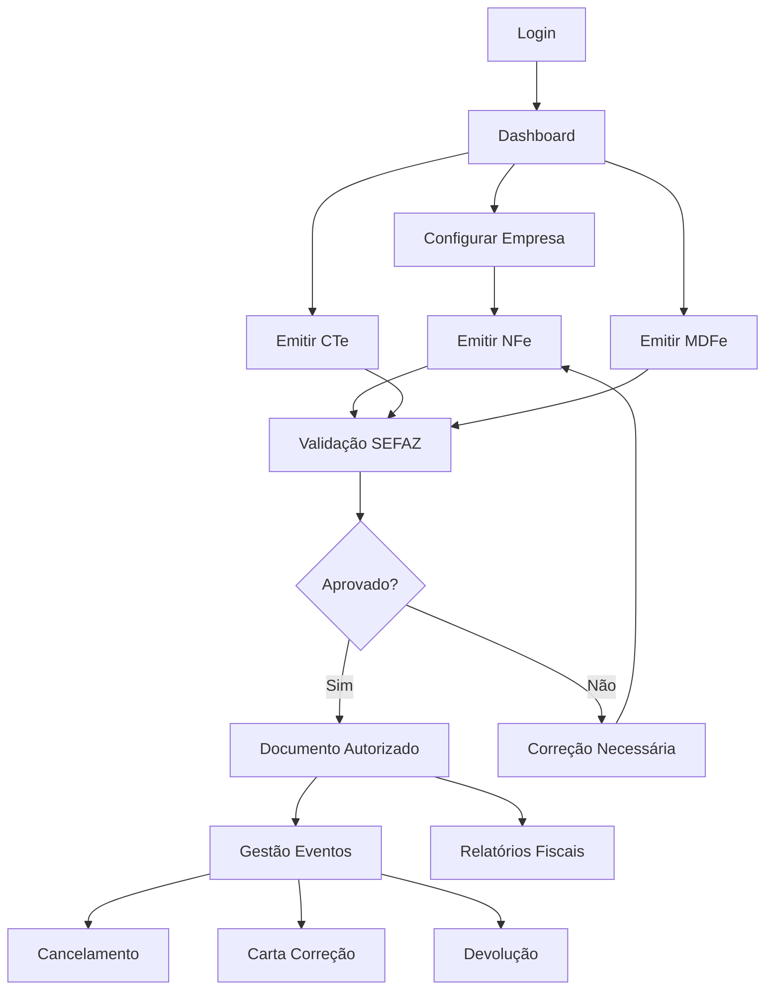

# PRD - Sistema NFe/CTe/MDFe Completo 2025/2026

## 1. Product Overview

Sistema completo de emissão de documentos fiscais eletrônicos (NFe, CTe, MDFe) em conformidade com a legislação brasileira vigente e preparado para a Reforma Tributária de 2026. O sistema oferece comunicação segura com a SEFAZ, cálculos tributários automáticos por regime fiscal e interface moderna para contadores e empresas.

- **Problema a resolver**: Emissão de documentos fiscais em conformidade legal, com cálculos tributários precisos e preparação para mudanças fiscais de 2026
- **Usuários**: Contadores, empresas de todos os portes, escritórios contábeis
- **Valor**: Segurança jurídica, conformidade fiscal, redução de erros, preparação para reforma tributária

## 2. Core Features

### 2.1 User Roles

| Role | Registration Method | Core Permissions |
|------|---------------------|------------------|
| Administrador | Cadastro direto no sistema | Gerenciar usuários, configurações globais, certificados, logs de auditoria |
| Contador | Convite do administrador | Emitir todos os documentos, gerenciar clientes, configurar empresas |
| Operador | Convite do contador | Emitir documentos básicos, consultar status, visualizar relatórios |
| Cliente | Convite do contador | Visualizar seus documentos, consultar status, baixar XMLs/PDFs |

### 2.2 Feature Module

Nosso sistema de documentos fiscais consiste nas seguintes páginas principais:

1. **Dashboard**: Visão geral de documentos emitidos, status SEFAZ, alertas de certificado, resumo tributário mensal
2. **Emissão NFe**: Formulário completo de emissão com cálculos automáticos, validações em tempo real, campos obrigatórios 2026
3. **Emissão CTe**: Formulário de conhecimento de transporte com validações de prazo, vínculos MDFe, cálculos de frete
4. **Emissão MDFe**: Manifesto eletrônico com controle de condutor, inclusão de documentos, encerramento automático
5. **Gestão de Eventos**: Cancelamento, carta de correção, inutilização, manifestação do destinatário
6. **Consultas SEFAZ**: Status de documentos, consulta por chave, validação de destinatário
7. **Relatórios Fiscais**: Livros fiscais, apuração de impostos, relatórios por regime tributário
8. **Configurações**: Certificados digitais, dados da empresa, regime tributário, parâmetros SEFAZ
9. **Auditoria**: Logs de sistema, histórico de operações, rastreabilidade completa

### 2.3 Page Details

| Page Name | Module Name | Feature description |
|-----------|-------------|---------------------|
| Dashboard | Status Overview | Display real-time SEFAZ status, certificate validity, monthly tax summary, pending operations alerts |
| Dashboard | Quick Actions | Quick access to emit NFe/CTe/MDFe, check document status, download XMLs |
| Dashboard | Tax Calculator | Preview tax calculations by regime, IBS/CBS simulator for 2026 |
| Emissão NFe | Product/Service Form | Add products with automatic GTIN validation, service descriptions, CFOP selection |
| Emissão NFe | Tax Calculation | Automatic calculation by tax regime (Simples, Presumido, Real), ICMS-ST, PIS/COFINS |
| Emissão NFe | 2026 Fields | IBS/CBS fields (optional 2025, mandatory 2026), IS for selective products |
| Emissão NFe | Validation Engine | Real-time XSD validation, SEFAZ rules check, duplicate prevention |
| Emissão CTe | Transport Data | Origin/destination, cargo details, freight calculation, modal selection |
| Emissão CTe | MDFe Integration | Link to existing MDFe, automatic cancellation rules, 24h/168h validation |
| Emissão MDFe | Document Management | Include CTe/NFe, conductor management, route planning |
| Emissão MDFe | Closure Control | Automatic closure, mileage tracking, fuel consumption |
| Gestão de Eventos | Cancellation | Time-based validation by state, MDFe/CTe dependency check, justification required |
| Gestão de Eventos | Correction Letter | Field validation (allowed/forbidden), correction history, automatic numbering |
| Gestão de Eventos | Return/Reversal | Symbolic return for ICMS taxpayers, reversal for expired cancellation |
| Gestão de Eventos | Referenced Invoice | Link original documents, justification, operation type selection |
| Consultas SEFAZ | Document Status | Query by access key, CNPJ batch query, real-time SEFAZ communication |
| Consultas SEFAZ | Recipient Manifestation | Confirm operation, unknown operation, operation not performed |
| Relatórios Fiscais | Tax Books | ICMS register, IPI register, ISS register, electronic books generation |
| Relatórios Fiscais | Tax Calculation | Monthly tax summary by regime, credit/debit analysis, 2026 simulation |
| Configurações | Digital Certificate | A1/A3 certificate management, validity alerts, automatic renewal reminders |
| Configurações | Company Data | Tax regime configuration, CNAE, state registration, municipal registration |
| Configurações | SEFAZ Parameters | Environment selection (homolog/production), timeout settings, retry logic |
| Auditoria | System Logs | All SEFAZ communications, user actions, error tracking, performance metrics |
| Auditoria | Compliance Reports | Legal compliance status, missing documents, tax inconsistencies |

## 3. Core Process

### Fluxo Principal do Contador:
1. **Login** → Autenticação com certificado digital
2. **Dashboard** → Visualização geral do status
3. **Configuração Empresa** → Definir regime tributário e parâmetros
4. **Emissão de Documentos** → NFe/CTe/MDFe com cálculos automáticos
5. **Validação SEFAZ** → Comunicação segura e validação
6. **Gestão de Eventos** → Cancelamentos, correções, devoluções
7. **Relatórios** → Apuração fiscal e compliance

### Fluxo do Cliente:
1. **Login** → Acesso restrito aos seus documentos
2. **Consulta Documentos** → Visualização de NFes emitidas
3. **Download** → XMLs e PDFs dos documentos
4. **Manifestação** → Confirmação de recebimento

## 4. User Interface Design

### 4.1 Design Style

- **Cores Primárias**: 
  - Azul Profissional: #1e40af (confiança, segurança)
  - Verde Sucesso: #059669 (aprovação, conformidade)
  - Vermelho Alerta: #dc2626 (erros, pendências)
- **Cores Secundárias**:
  - Cinza Neutro: #6b7280 (textos secundários)
  - Azul Claro: #dbeafe (backgrounds, cards)
- **Botões**: Estilo moderno com bordas arredondadas (8px), sombras sutis, estados hover/active
- **Tipografia**: 
  - Fonte: Inter (legibilidade profissional)
  - Tamanhos: 14px (texto), 16px (labels), 18px (títulos), 24px (headers)
- **Layout**: Design baseado em cards, navegação lateral fixa, breadcrumbs, grid responsivo
- **Ícones**: Lucide React (consistência, modernidade), ícones de status coloridos

### 4.2 Page Design Overview

| Page Name | Module Name | UI Elements |
|-----------|-------------|-------------|
| Dashboard | Status Cards | Cards com bordas coloridas (verde=ok, vermelho=erro), ícones de status, números grandes para KPIs |
| Dashboard | Quick Actions | Botões grandes com ícones, cores diferenciadas por tipo de documento, hover effects |
| Emissão NFe | Form Layout | Layout em 2 colunas, campos agrupados por seção, validação em tempo real com bordas coloridas |
| Emissão NFe | Tax Display | Cards destacados para cálculos, tabela de impostos com cores alternadas, totais em destaque |
| Gestão de Eventos | Action Buttons | Botões com confirmação modal, cores específicas (vermelho=cancelar, azul=corrigir) |
| Relatórios | Data Tables | Tabelas responsivas com filtros, paginação, exportação, gráficos Chart.js |
| Configurações | Form Sections | Abas organizadas, campos de upload para certificados, indicadores de status |

### 4.3 Responsiveness

- **Desktop-first**: Otimizado para uso profissional em desktop
- **Mobile-adaptive**: Navegação colapsável, tabelas horizontalmente scrolláveis, formulários empilhados
- **Touch-friendly**: Botões com tamanho mínimo 44px, espaçamento adequado para touch
- **Breakpoints**: 
  - Desktop: 1024px+
  - Tablet: 768px-1023px  
  - Mobile: 320px-767px

## 5. Funcionalidades Específicas 2025/2026

### 5.1 Campos Obrigatórios 2025

- **NFC-e apenas para CPF**: Validação automática, bloqueio para CNPJ
- **NFe obrigatória para CNPJ**: Redirecionamento automático
- **TLS 1.2+**: Verificação de protocolo de segurança
- **GTIN obrigatório**: Validação ou "SEM GTIN"
- **Rastreabilidade**: Campos para medicamentos, bebidas, cigarros

### 5.2 Preparação 2026

- **Campos IBS/CBS**: Interface preparada, cálculos implementados
- **Simulador Tributário**: Comparação sistema atual vs 2026
- **Migração Gradual**: Interface para ativação progressiva
- **Treinamento**: Tutoriais integrados sobre mudanças

### 5.3 Cálculos Automáticos

- **Por Regime Tributário**: Simples Nacional, Lucro Presumido, Lucro Real
- **Substituição Tributária**: Cálculo automático de MVA e ICMS-ST
- **Observações Legais**: Geração automática de textos obrigatórios
- **Validação Cruzada**: Verificação de consistência entre valores

### 5.4 Segurança e Auditoria

- **Certificado Digital**: Gestão A1/A3, alertas de vencimento
- **Logs Completos**: Rastreabilidade total de operações
- **Backup Automático**: XMLs e dados críticos
- **Controle de Acesso**: Permissões granulares por usuário

---

**Versão**: 1.0  
**Data**: Dezembro 2024  
**Próxima Revisão**: Janeiro 2025 (implementação obrigatória IBS/CBS)